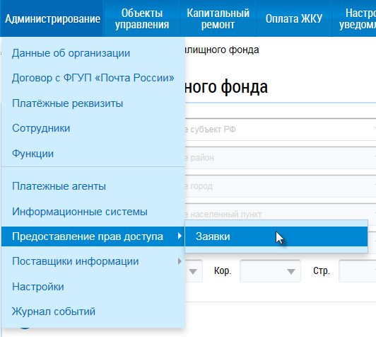
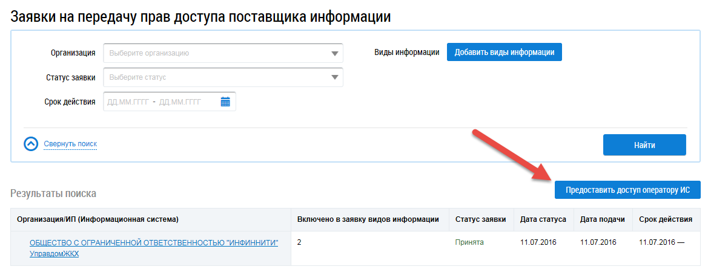
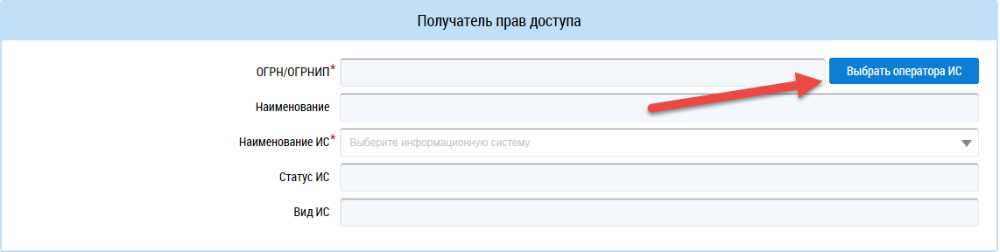
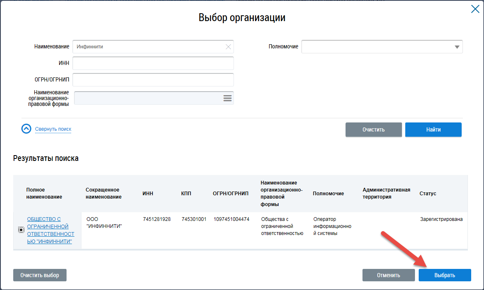
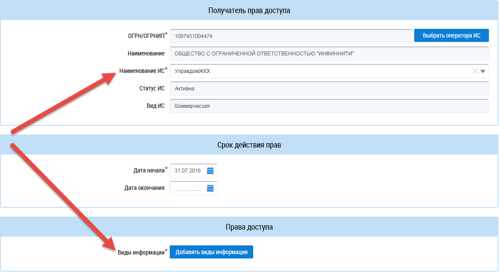

Как делегировать полномочия на передачу данных?
-----------------------------------------------

Для того, чтобы делегировать права доступа Оператору ИС, необходим:

#. Войти в личный кабинет организации с ролью "Администратор организации" в ГИС ЖКХ, с признаком "Руководитель организации".
#. В главном меню выбрать раздел "Администрирование" - "Предоставление прав доступа" – "Заявки".

#. Нажать на кнопку «Предоставить доступ оператору ИС».

#. В разделе заявки "Получатель прав доступа" нажать на кнопку "Выбрать оператора ИС".

#. В окне "Выбор организации" ввести наименование организации "Инфиннити", затем найти и выбрать - ООО "Инфиннити".

#. В поле "Наименование ИС" выбрать "УправдомЖКХ" и указать виды информации, по которым необходимо делегировать права.

#. Нажать на кнопку «Отправить заявку». 