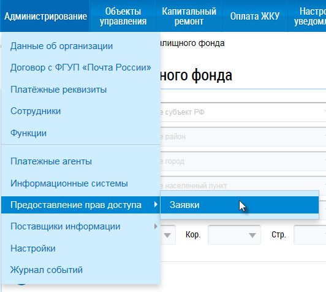
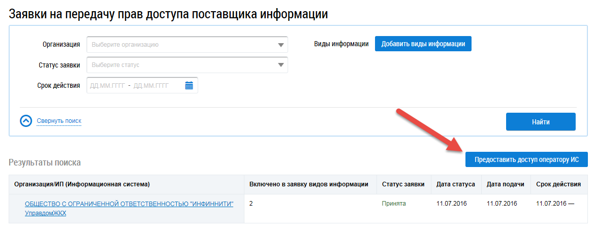
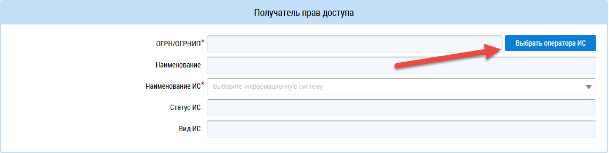
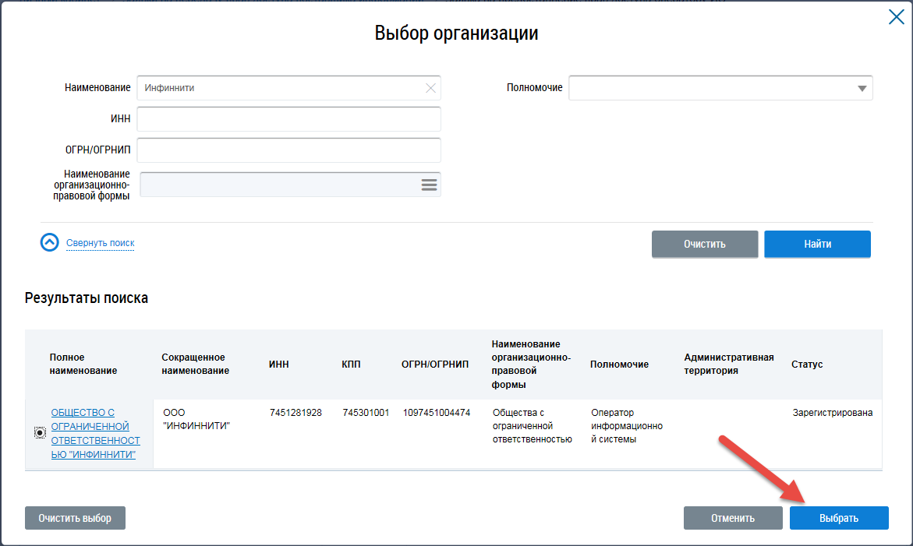
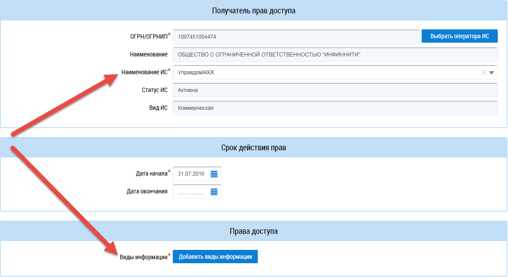

Как делегировать полномочия на передачу данных?
-----------------------------------------------

Для того, чтобы делегировать права доступа Оператору ИС, необходимо:

1. Перейти на сайт `ГИС ЖКХ <https://dom.gosuslugi.ru/#/main>`_.

2. Войти в личный кабинет организации с ролью «Администратор организации" в ГИС ЖКХ, с признаком «Руководитель организации».

3. В главном меню выбрать раздел «Администрирование» - «Предоставление прав доступа» – «Заявки».

4. Нажать кнопку «Предоставить доступ оператору ИС».

5. В разделе заявки «Получатель прав доступа» нажать кнопку «Выбрать оператора ИС».

6. В окне «Выбор организации» ввести наименование организации «Инфиннити», затем найти и выбрать - ООО "Инфиннити».

7. В поле «Наименование ИС» выбрать «УправдомЖКХ» и указать виды информации, по которым необходимо делегировать права.

8. Нажать кнопку «Отправить заявку». 