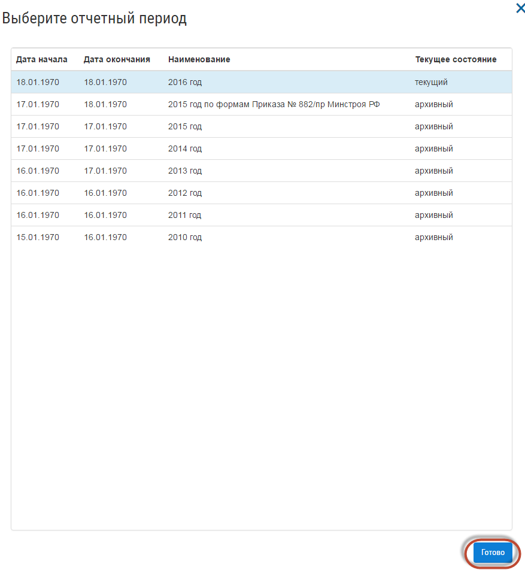
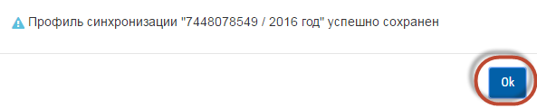
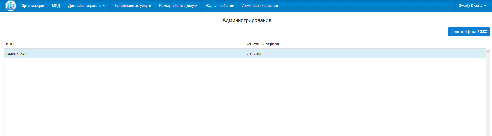
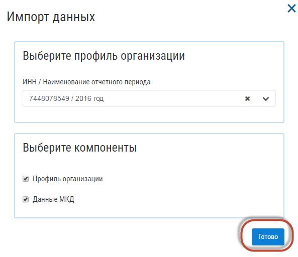
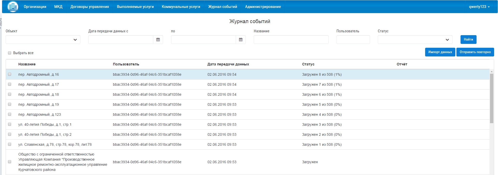

Начало работы
=============
Общие сведения
--------------
Настройка соединения с Реформой ЖКХ
------------------------------------
Для того чтобы настроить синхронизацию, перейдите на вкладку «Администрирование». Нажмите на кнопку «Связь с Реформой ЖКХ».

.. image:: ../_images/01-beginning-of-work/1.png

В открывшемся окне введите ИНН вашей организации Логин и Пароль, которые были присвоены вашей управляющей организации при работе в системе Реформа ЖКХ.
Нажмите на кнопку «Получить список отчетных периодов». Выберете отчетный период, данные по которому вы хотите загрузить в систему и нажмите кнопку «Готово».

При успешной установке соединения, на экране появится окно. Нажмите на кнопку «ОК», для продолжения работы в системе.

После закрытия окна, в разделе «Администрирование», появится строка с загруженным отчетным периодом. 

Первичная загрузка данных с портала Реформа ЖКХ
-----------------------------------------------

Для загрузки данных перейдите в раздел «Журнал событий». Нажмите кнопку «Импорт данных». В открывшемся окне, выберете данные ИНН/Наименование отчетного периода, а также укажите объекты (Организацию, МКД), которые требуется загрузить. Нажмите кнопку «Готово».

После нажатия кнопки, начнется загрузка объектов. Загруженные МКД и Организация, будут отображены в разделе «Журнал событий».

Для загрузки данных из портала Реформа ЖКХ в систему  Управдом ЖКХ, необходимо настроить синхронизацию. Для этого перейдите на вкладку «Администрирование». 

