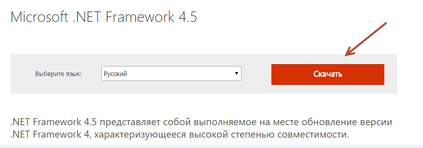
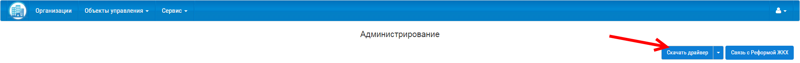
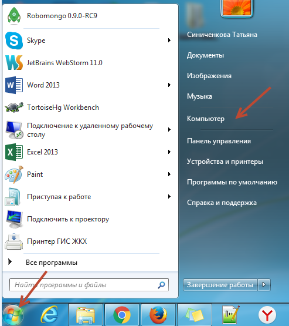
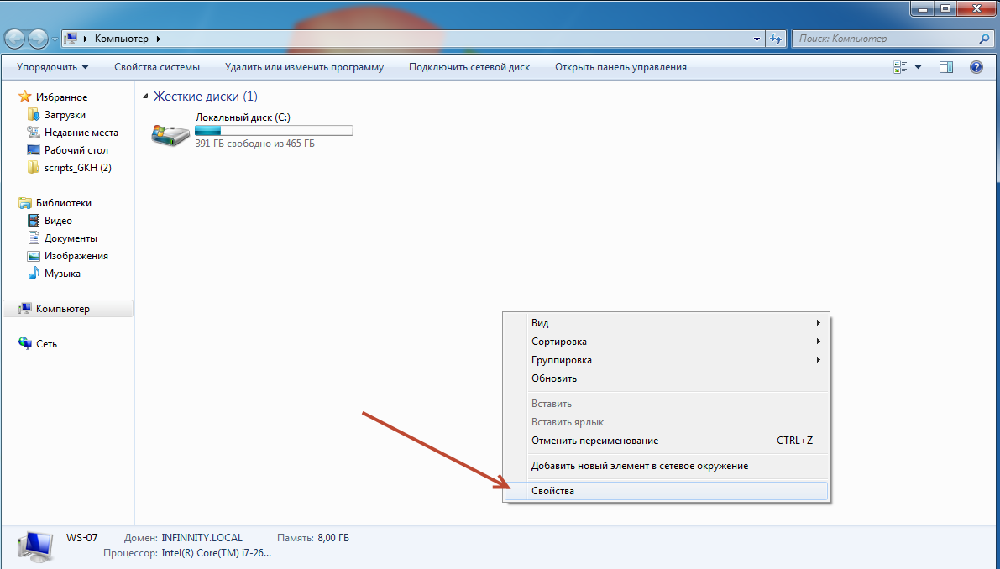
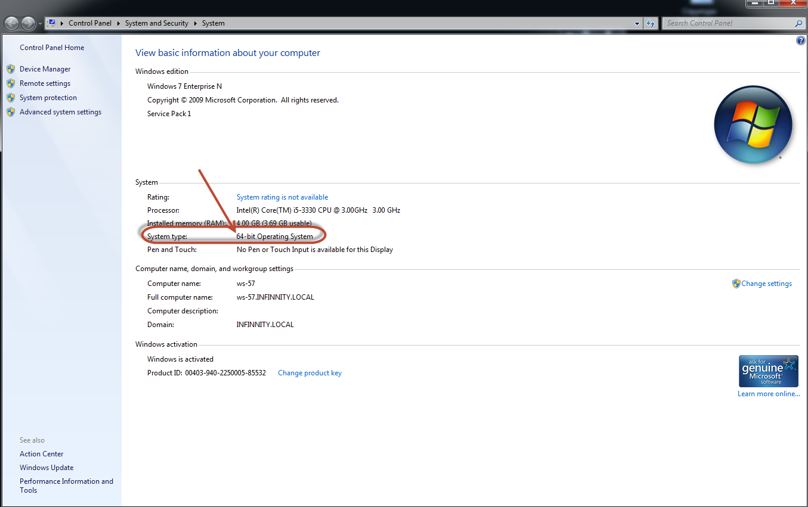
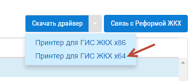
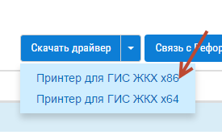
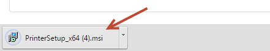
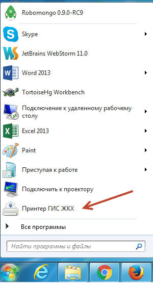
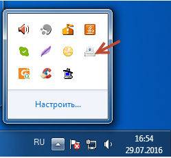

Как скачать и установить принтер?
---------------------

Для работы с принтером скачайте и установите Microsoft .NET Framework 4.5 по `ссылке <https://www.microsoft.com/ru-ru/download/details.aspx?id=30653>`_  

Затем перейти в раздел "Администрирование", системы "Управдом ЖКХ".

Нажмите на кнопку "Скачать драйвер"

Выберите версию, соответствующую характеристикам вашего компьютера.  Узнать версию вашей ОС можно нажав кнопку "Пуск", выбрать "Компьютер".

Затем в открывшемся окне, кликните правой кнопки мыши и выберете "Свойства".

В новом окне, вы можете посмотреть системные характеристики вашего компьютера.

Если у вас указано 64 - разрядная операционная система, вам требуется принтер х64.

Если у вас указано значение 32 - разрядная операционная система, вам требуется принтер х86.

После того, как загрузка завершится, откройте загруженный файл, и установите принтер согласно пошаговым указаниям.

Запустите установленный драйвер принтера из меню "Пуск".

Для того, чтобы открыть интерфейс принтера, кликните два раза левой кнопки мыши по значку по значку принтера в системном трее.

