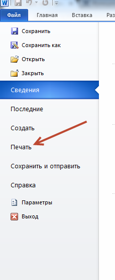
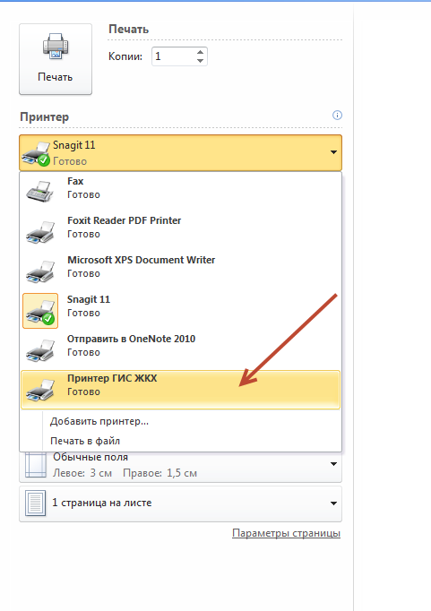
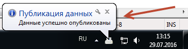

Отправка первой квитанции
-----------------

Чтобы начать массовую загрузку квитанций, необходимо отправить на печать пример Вашей квитанции. Этот пример будет обработан и в систему будут добавлены индивидуальные настройки для Вашй организации.
Для отправки первой квитанции выполните следующие действия:

* Откройте документ содержащий квитанцию. Выберете в меню "Печать".

* Выберите принтер ГИС ЖКХ и нажмите кнопку "Печать".

Если установка прошла успешно, в нижней части вашего экрана появится сообщение. Также вы полчите письмо на электронную почту, указанную вами при регистрации.

После успешной печати первой квитанции, вы можете печатать платежные документы массово.

