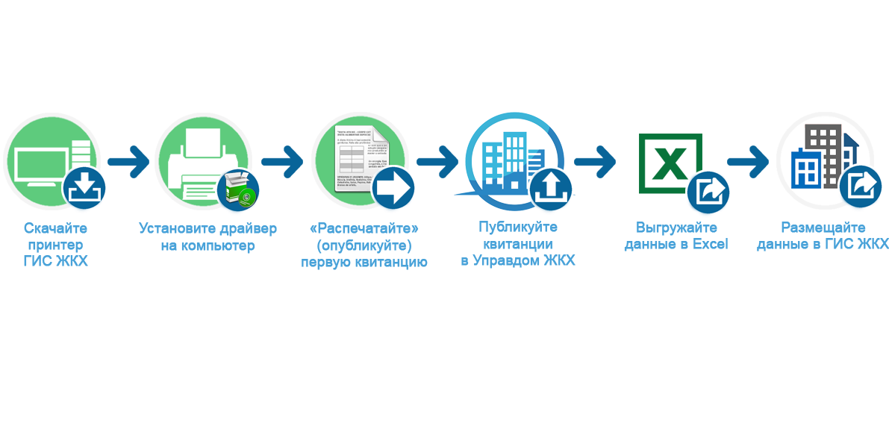

Общий принцип работы
-----------------

В каждой квитанции на оплату содержится обязательная информация для публикации в федеральных системах. 
Вы отправляете квитанцию (квитанции) на печать с помощью Принтера ГИС ЖКХ. 
Далее Принтер ГИС ЖКХ совершает следующие шаги:

#.	Читает ваши квитанции;
#.	Находит необходимую информацию о платежных документах, лицевых счетах, помещениях;
#.	Распознает найденную информацию;
#.	Преобразует информацию к требуемому ГИС ЖКХ виду;
#.	Публикует информацию в «Управдом ЖКХ» в той форме, которую требует федеральная система.

