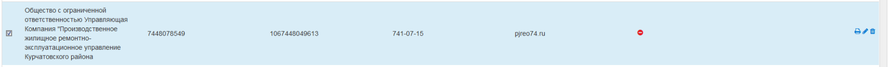
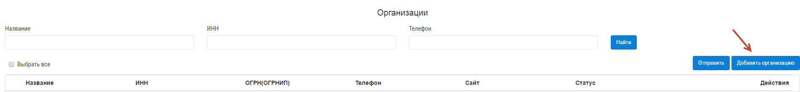
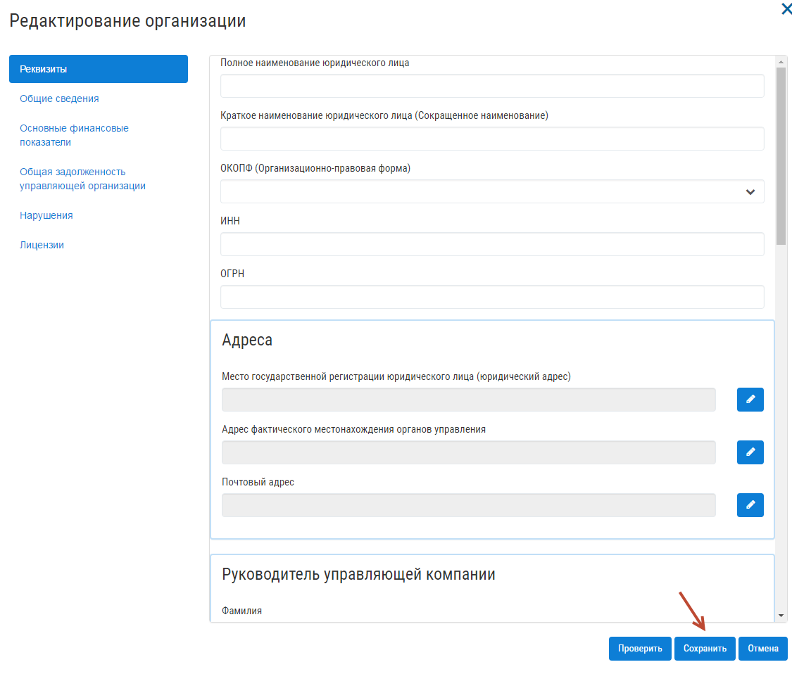

Как разместить организацию?
------------------------

 **В связи с недоступностью сервисов ГИС ЖКХ, функциональность размещения данных по организации недоступна** 

Для того, чтобы раскрыть информацию по управляющей организации на ГИС ЖКХ, перейдите в раздел "Организации".

Если вами уже создана организация в разделе, выберите организацию из списка и нажмите на кнопку "Отправить"

Если вами не создана организация, нажмите на кнопку "Добавить организацию".

Заполните данные об организации и нажмите кнопку "Сохранить".

После сохранения организации, выберите ее в журнале организаций и нажмите кнопку "Отправить".