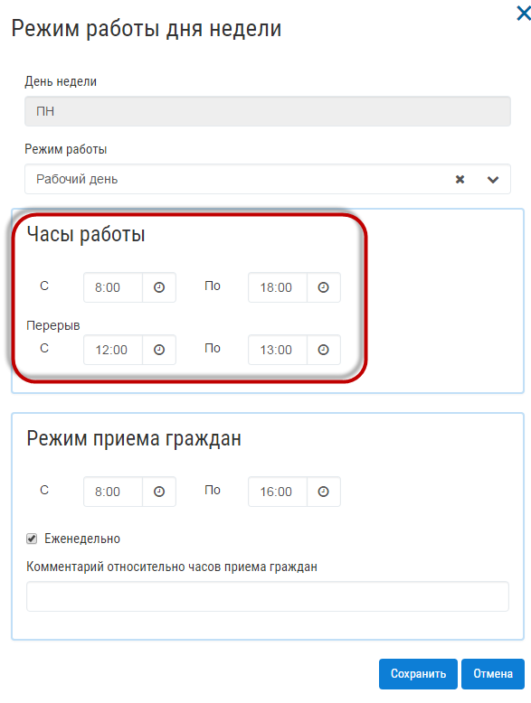
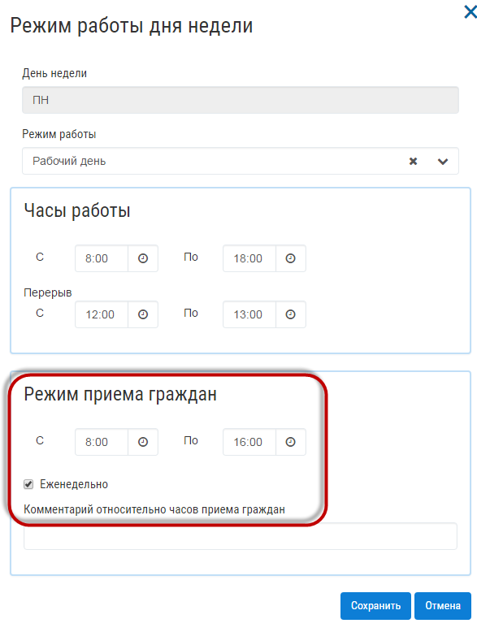
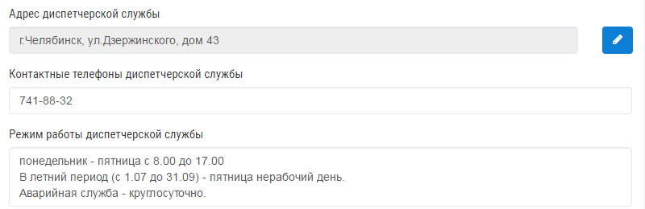
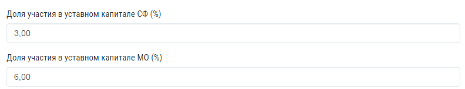
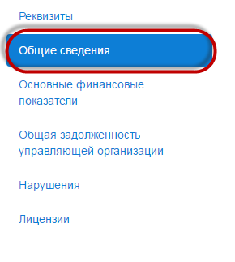
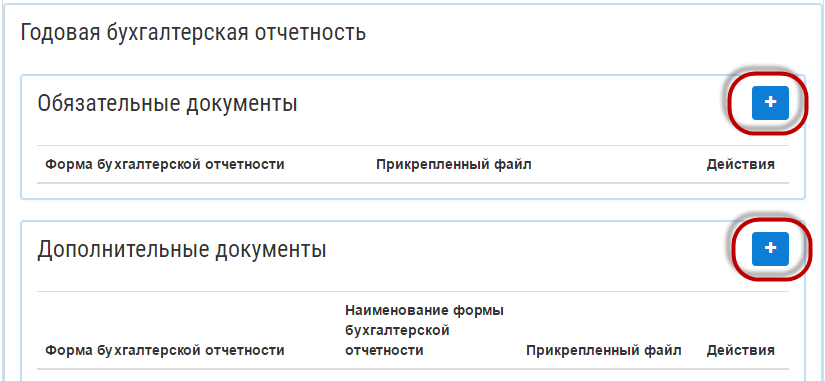
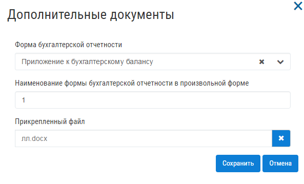
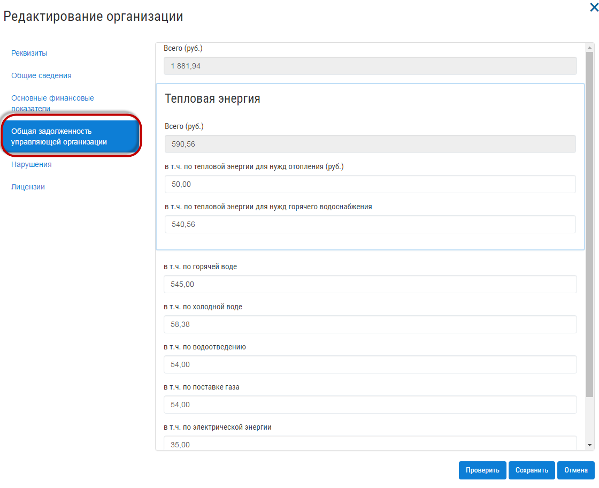

Как разместить организацию?
------------------------

**Обязательные поля, которые требуется заполнить для публикации в ГИС ЖКХ:**

*	Полное наименование юридического лица
*	Краткое наименование юридического лица
*	ОКОПФ
*	ИНН
*	ОГРН
*	Место государственной регистрации юридического лица
*	Руководитель управляющей организации (ФИО)
*	Контактный номер председателя (Только для ТСЖ, ЖСК, иного потребительского кооператива).
*	Часовая зона
*	Режим работы (в т.ч. личного приема граждан) – обязательны к заполнению все дни недели. При заполнении дня недели, где в поле «Режим работы», выбрано значение «Рабочий день», требуется заполнить блок «Часы работы С – По » , включая «Перерыв С - По» 

При заполнении блока «Режим приема граждан», требуется заполнить поля **«С - По»**, а также поставить галочку для значения, для значения **«Еженедельно»**.

После внесения изменений, нажмите кнопку «Сохранить».

Затем заполните блок «Диспетчерская служба».

Затем заполните поля «Доля участия в уставном капитале СФ» и «Доля участия в уставном капитале МО%».

Перейдите на вкладку «Общие сведения», для заполнения.

На вкладке «Общие сведения», обязательно заполните блок «Штатная численность» (Административный персонал, Инженеры, Рабочие). 

.. image:: ../_images/02-employment-section-organization/06_number_of_staff.png

При заполнении блока «Сведения о членстве управляющей организации в саморегулируемой организации», требуется заполнить поля «Сведения о членстве управляющей организации в саморегулируемой организации», «ОГРН саморегулируемой организации».

Для публикации обязательно к заполнению вкладка «Основные финансовые показатели»:

*	Отчетный период (Дата начала)
*	Отчетный период (Дата окончания)
*	Блок «Годовая бухгалтерская отчетность» - прикрепите файлы. 

При добавлении документов в блок «Дополнительные документы», обязательными для заполнения являются поля:
Форма бухгалтерской отчетности, Наименование формы бухгалтерской отчетности, Прикрепленный файл.

*	Сведения о доходах (руб.)
*	Сведения о расходах (руб.)

Затем заполните вкладку «Общая задолженность управляющей организации»

После заполнения обязательных поля для публикации, нажмите на кнопку «Сохранить».
.. include:: 2.6.rst
