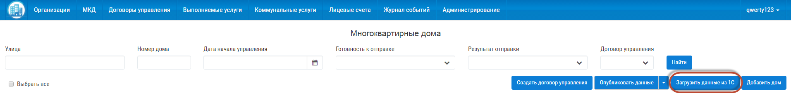
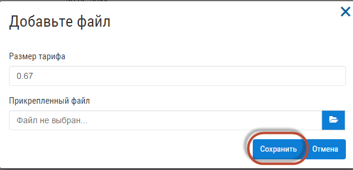

Добавление нового МКД
------------------------

Для добавления дома нажмите на кнопку «Добавить дом».

.. image:: ../_images/03-work-section-mkd/15.png

Заполните поля открывшейся формы и нажмите кнопку "Сохранить".

Также для заполнения дома можно воспользоваться кнопкой «Загрузить данные из 1С», нажав на нее.

Информация, содержащаяся в архиве, частично заполнит данные по дому.  После прикрепления файла, нажмите кнопку «Сохранить».

Дозаполните поля МКД, после загрузки данных из файла и сохраните.