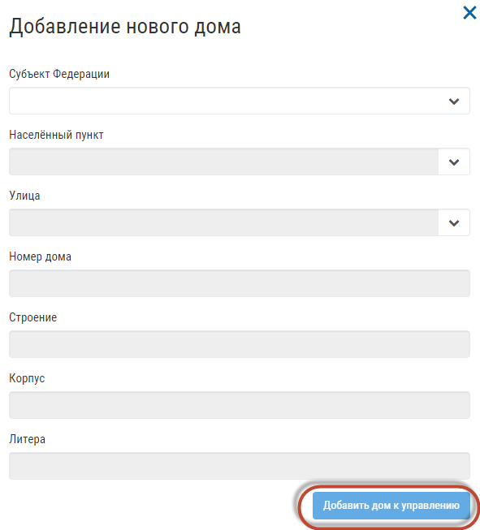
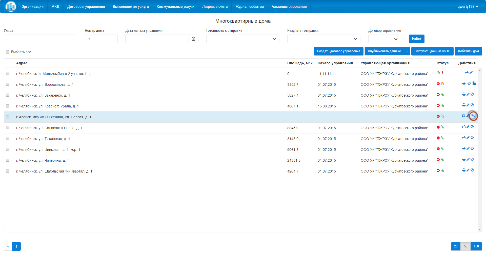

Добавить дом к управлению можно при создании нового многоквартирного дома с помощью кнопки «Добавить дом к управлению».

Если дом при создании не был добавлен к управлению, вы можете найти его в списке многоквартиных домов, и добавить к управлению нажав на кнопку.

