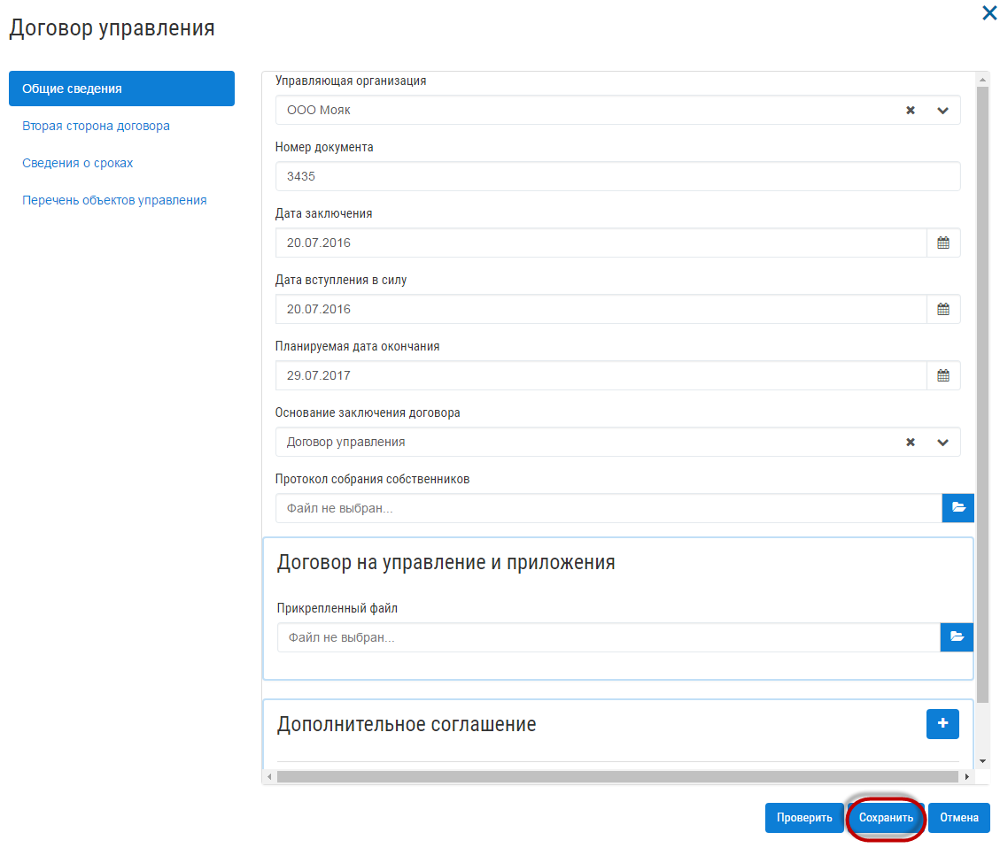

Как разместить договор управления?
----------------------------- 

Для того, чтобы разместить многоквартирные дома на ГИС ЖКХ, первым шагом необходимо опубликовать договора управления.
Для этого перейти на вкладку "Договоры управления"

Нажмите на кнопку "Добавить договор".

В открывшемся окне, заполните поля договора управления, укажите перечень объектов управления и нажмите кнопку "Сохранить".

Затем выберите договор управления в списке и нажмите кнопку "Отправить".

