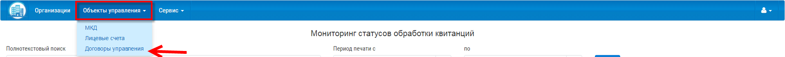

Как разместить договор управления?
----------------------------- 

Для размещения договора управления на ГИС ЖКХ, перйдите в раздел  "Договоры управления".

Если у вас уже создан/ы договор/ы управления, выбрите его из списка договоров управления и нажмите кнопку "Отправить".

.. image:: ../_images/03-work-section-mkd/30.png

Если у вас нет договора управления, вы можеите его создать, выполнив действия:

* Нажмите на кнопку "Добавить договор".

.. image:: ../_images/03-work-section-mkd/12.png

* В открывшемся окне, заполните поля договора управления, а также укажите перечень объектов управления. Для этого нажмите на кнопку "Выбрать дом".

.. image:: ../_images/03-work-section-mkd/28.png

* В открывшемся окне выберете многоквартирный дом/а, который/ые относятся к договору управления и нажмите кнопку "Сохранить".

.. image:: ../_images/03-work-section-mkd/29.png

* Сохраните изменения.

* Затем выберете договор из списка договоров управления и нажмите кнопку "Отправить".

