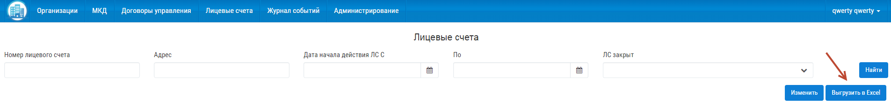
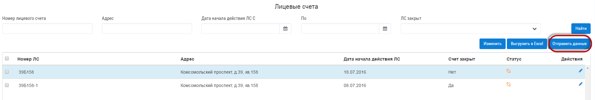

Как разместить лицевые счета?
-------------------------------

Разместить лицевые счета на ГИС ЖКХ, вы можете двумя способами:
 
* Выгрузить в лицевая счета в Управдом ЖКХ в Excel, а затем загрузить лицевые счета в личном кабинете организации в ГИС ЖКХ.

Для этого перейтите в раздел "Лицевые счета". Нажмите на кнопку "Выгрузить в Excel".

В открывшемся окне, выбирете количество записей в документе, которые будут выгружены в Excel. Затем нажмите на кнопку "Получить архив".

После загрузки архива, полученные Excel документы, вы можете загрузить в личном кабинете ГИС ЖКХ, в разделе "Лицевые счета".

* С помощью сервиса в системе Управдом ЖКХ

 **В связи с недоступностью сервисов ГИС ЖКХ, функциональность размещения лицевых счетов недоступна**
 
Для размещения лицевых счетов на ГИС ЖКХ, перейдите в раздел "Лицевые счета"

Выберете лицевые счета из списка и нажмите кнопку "Отправить данные"

