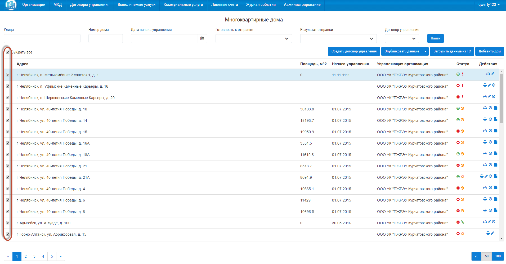
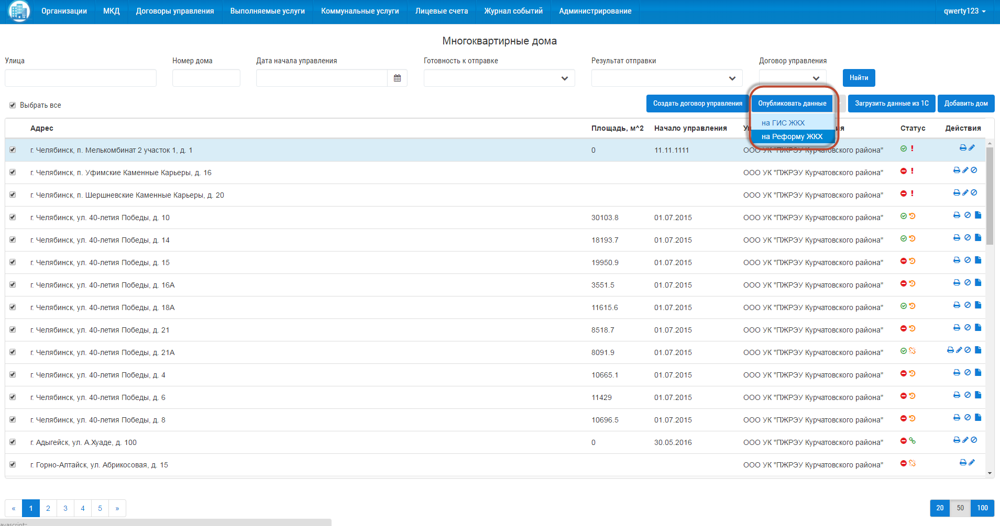

Для публикации МКД на Реформу ЖКХ, выберете дома, которые требуется отправить, поставив галочки, напротив объектов. Для выбора всех объектов со страницы, поставьте галочку «Выбрать все».

Затем нажмите на кнопку «Опубликовать данные» и из выпадающего списка выберите «на Реформу ЖКХ».

Статус отправки объектов вы можете посмотреть в разделе «Журнал событий».