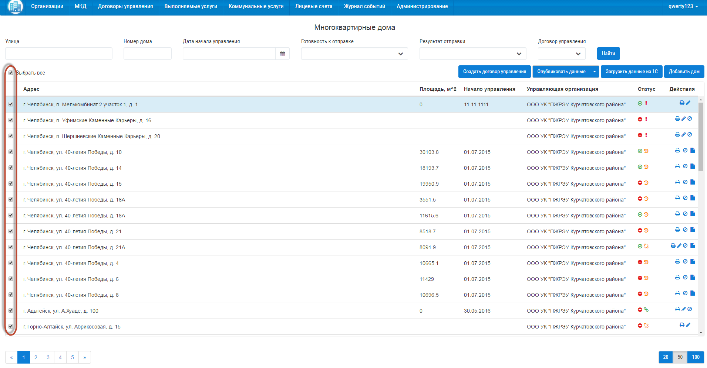
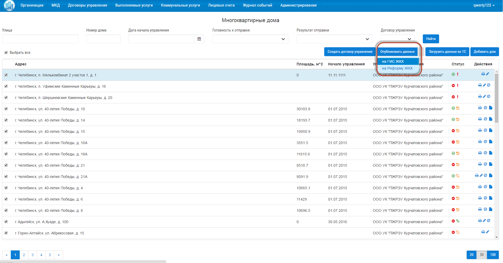

Как разместить МКД?
-------------------------

Для успешного размещения информации по многоквартирным домам на ГИС ЖКХ, у вашей организации должны быть размещены договоры управления. Как разместить договор управления описано в разделе "3.2. Как разместить договор управлдения?".

Для публикации МКД на ГИС ЖКХ, выберете дома, которые требуется отправить, поставив галочки, напротив объектов. Для выбора всех многоквартирных домов со страницы, поставьте галочку «Выбрать все».

Затем нажмите на кнопку «Опубликовать данные» из выпадающего списка выберите «на ГИС ЖКХ».

Статус отправки объектов вы можете посмотреть в разделе «Журнал событий».