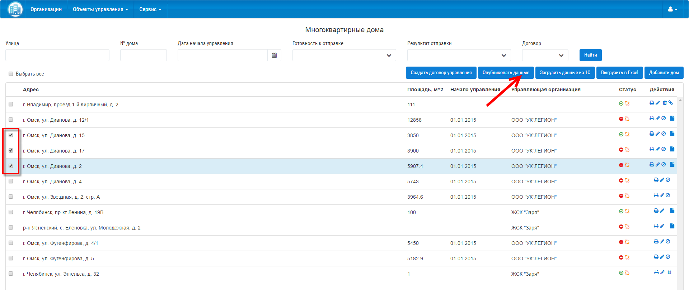

Как раскрыть сведения по управлению МКД?
-------------------------

Для успешного размещения информации по многоквартирным домам на ГИС ЖКХ, у Вашей организации должны быть опубликованы договоры управления. 

**Как добавить многоквартирный дом описано в** `разделе 4.3 <http://127.0.0.1:8000/04-management-agreements/index.html#id4>`_.

**Как разместить договор управления описано в** `разделе 3.2 <http://127.0.0.1:8000/03-work-section-mkd/index.html#id4>`_.

Раскрыть сведения по управлению многоквартирными домами на ГИС ЖКХ можно двумя способами:
 
* Выгрузить сведения по многоквартирным домам в Excel-шаблон для ГИС ЖКХ.
* С помощью сервисов ГИС ЖКХ.
  
В первом случае  выгружаются сведения по многоквартирным домам в Excel-шаблон, который пользователь может загрузить в личном кабинете на сайте `ГИС ЖКХ <https://dom.gosuslugi.ru/#/main>`_.
Во втором случае сведения по многоквартирным домам выгружаются напрямую из Управдом ЖКХ в ГИС ЖКХ.  
  
**Выгрузить сведения по многоквартирным домам в Excel-шаблон для ГИС ЖКХ:**

1. Перейти в раздел «МКД».

2. Выбрать необходимые для выгрузки дома.

3. Нажать кнопку «Выгрузить в Excel».

.. image:: ../_images/03-work-section-mkd/113.png

**Раскрыть сведения по многоквартирным домам с помощью сервисов ГИС ЖКХ:**

1. Перейти в раздел «МКД».

2. Выбрать из списка необходимые многоквартирные дома.

3. Нажать кнопку «Опубликовать данные».

4. Из выпадающего списка выбрать пункт «на ГИС ЖКХ».

