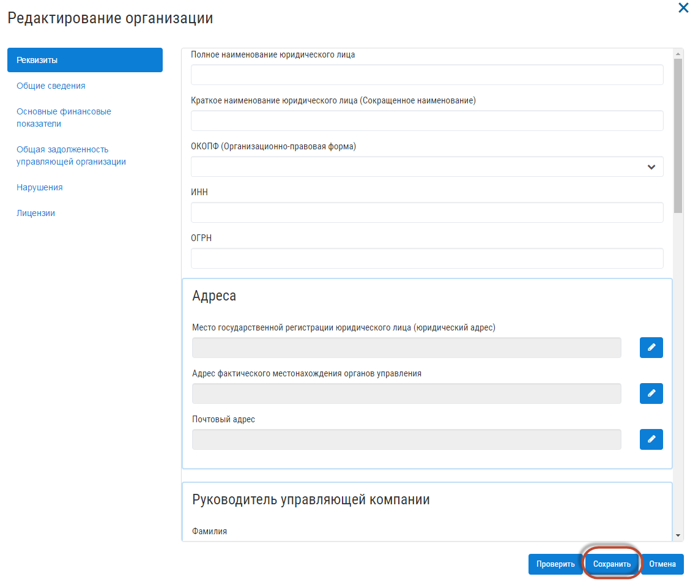
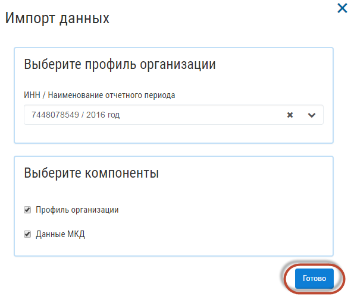

По организации
------------------------

Заполнить сведения по организации можно двумя способами: 

* Вручную 

Чтобы заполнить организацию вручную, нажмите на кнопку «Добавить организацию».

.. image:: ../_images/04-management-agreements/1.png

Заполните поля открывшейся формы, сведениями об организации и нажмите кнопку «Сохранить».

* Загрузить с Реформы ЖКХ

Для импорта данных по организации с Реформы ЖКХ нажмите на кнопку «Импорт данных».

.. image:: ../_images/04-management-agreements/3.png

Введите ИНН/Наименование отчетного периода, данные по которому требуется загрузить, а также Профиль организации и нажмите кнопку «Готово».

Загруженные данные по организации отобразятся в разделе "Организации".

