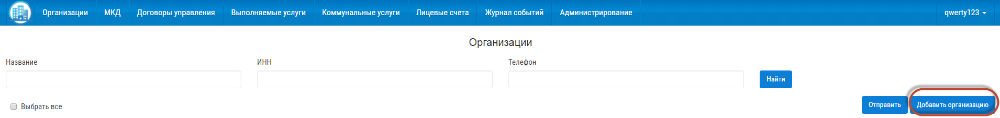
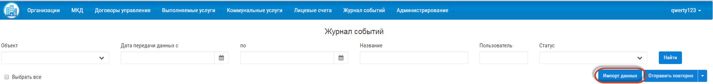

По организации
------------------------

Заполнить сведения по организации можно двумя способами: 

- Вручную.

- Загрузить с Реформы ЖКХ.

В первом случае пользователь самостоятельно вводит данные на сайте "Управдом ЖКХ". Во втором случае данные импортируются с сайта `Реформа ЖКХ <https://www.reformagkh.ru/>`_.

**Вручную:**

1. Перейти в раздел «Организации».

2. Нажать кнопку «Добавить организацию».

3. Заполнить поля открывшейся формы сведениями об организации.

4. Нажать кнопку «Сохранить».

	.. image:: ../_images/04-management-agreements/2.png

**Загрузить с Реформы ЖКХ:**

1. Для импорта данных по организации с Реформы ЖКХ нажать кнопку «Импорт данных».

2. Ввести ИНН/Наименование отчетного периода, данные по которому требуется загрузить, а также Профиль организации.

3. Нажать кнопку «Готово».

	.. image:: ../_images/04-management-agreements/4.png

Загруженные данные по организации отобразятся в разделе «Организации».

