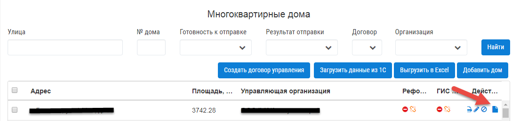
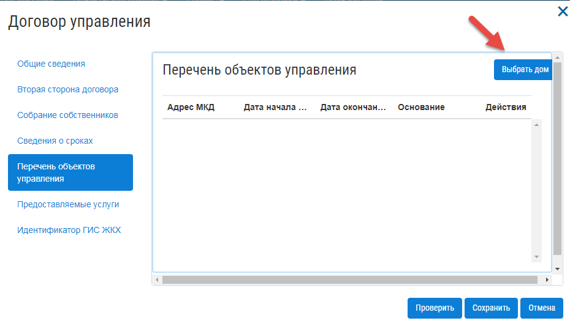

По договору управления
------------------------------
Добавить договор управления можно двумя способами:

- Из журнала «МКД».

- Из журнала «Договоры управления».

В первом случае пользователь сразу может увидеть список домов, для которых требуется создать договоры управления. Во втором случае необходимо открыть договор управления, перейти во вкладку и только потом появится возможномть добавить список домов.

**Из журнала «МКД»:**

Для того, чтобы добавить договор управления для многоквартирного дома, необходимо:
 
1. Перейти в раздел «МКД». 
2. Выбрать из списка многоквартирный дом/список многоквартирных домов, для которого требуется создать договор управления. 
3. Нажать на кнопку «Создать договор управления».

.. image:: ../_images/04-management-agreements/32.png

4. Подтвердить создание договоров управления нажатием кнопки «Да».

.. image:: ../_images/04-management-agreements/33.png

После автоматического обновления журнала, для выбранных домов отобразятся созданные договоры управления.

**Из журнала «Договоры управления»:**

1. Нажать кнопку «Добавить договор».

.. image:: ../_images/04-management-agreements/28.png

2. На вкладке «Перечень объектов управления» нажать кнопку «Выбрать дом» для того, чтобы прикрепить многоквартирный дом/дома, которые относятся к создаваемому договору управления. 

3. В открывшемся списке выбрать МКД.

4. Нажать кнопку «Сохранить».

.. image:: ../_images/04-management-agreements/30.png

5. После заполнения всех вкладок «Договора управления» нажать кнопку «Сохранить».

.. image:: ../_images/04-management-agreements/31.png

Сохраненный договор управления появится в журнале «Договоры управления».

**Для редактирования договора управления следует:** 

1.Нажать кнопку «Редактировать». 

.. image:: ../_images/04-management-agreements/35.png

2. В открывшейся форме внесите необходимые изменения.

3. Нажать кнопку «Сохранить».

.. image:: ../_images/04-management-agreements/36.png

Отредактировать договор управления можно из журнала МКД. Для этого требуется открыть напротив дома договор управления, который требуется изменить. 

.. image:: ../_images/04-management-agreements/37.png

