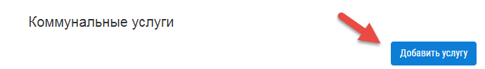
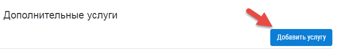

Как ввести данные вручную?
-------------------------
По организации
~~~~~~~~~~~~~~

**Для ручного заполнения данных по организации следует:**

1. Перейти в раздел «Организации».

	.. image:: ../_images/04-management-agreements/0.png

2. Нажать кнопку «Добавить организацию».

	.. image:: ../_images/04-management-agreements/1.png

3. Заполнить поля открывшейся формы сведениями об организации. 

Для добавления услуг, предоставляемых организацией, открыть раздел «Предоставляемые услуги». 
Для добавления всех услуг из справочника «Коммунальные услуги», в таблицу «Виды КУ», нажать на кнопку «Добавить все». 

.. image:: ../_images/04-management-agreements/72.png

Для добавления услуг из справочника «Коммунальные услуги», в таблицу «Виды КУ», нажать на кнопку добавления.

.. image:: ../_images/04-management-agreements/73.png

Выбрать услуги из списка в открывшейся форме. Нажать кнопку «Добавить».

.. image:: ../_images/04-management-agreements/76.png

Для добавления всех услуг из справочника «Дополнительные услуги» нажать на кнопку «Добавить все»

.. image:: ../_images/04-management-agreements/74.png

Для добавления услуг из справочника «Дополнительные услуги» нажать на кнопку добавления.

.. image:: ../_images/04-management-agreements/75.png

Выбрать услуги из списка в открывшейся форме. Нажать кнопку «Добавить».

Для синхронизации справочников с ГИС ЖКХ, требуется заполнить поле «Код организации в ГИС ЖКХ». Код организации формируется в личном кабинете после делегирования УО прав доступа, на размещение данных, опрератору ИС.
Для просмотра идентификатора ИС, в личном кабинете ГИС ЖКХ откройте «Администрирование» -> «Информационные системы»

В таблице «Информационные системы» можно посмотреть идентификатор информационной системы.

.. image:: ../_images/04-management-agreements/89.png

После заполнения индентификатора организации, можно выполнить процесс синхронизации с ГИС ЖКХ. Услуги, которые были добавлены в личном кабинете ГИС ЖКХ, будут загружены в Управдом ЖКХ, и наоборот. 
Если во время синхронизации справочников возникли ошибки, выполните синхронизацию повторно.

Для этого выберите организацию из журнала «Организации».

.. image:: ../_images/04-management-agreements/86.png

Нажмите кнопку «Синхронизировать справочники».

4. Нажать кнопку «Сохранить».

	.. image:: ../_images/04-management-agreements/78.png

По предоставляемым услугам
~~~~~~~~~~~~~~~~~~~~~~~~	
Для размещения информацию по **коммунальным услугам** следует: 

1. Выбрать в верхнем меню пункт «Справочники» -> «Коммунальные услуги».

.. image:: ../_images/04-management-agreements/63.png
	
2. Нажать кнопку «Добавить услугу».

3. Заполнить поля открывшейся формы.

4. Нажать кнопку «Сохранить»

.. image:: ../_images/04-management-agreements/65.png	

Услуга отобразится в журнале «Коммунальные услуги»

Для размещения информацию по **дополнительным услугам** следует: 

1. Выбрать в верхнем меню пункт «Справочники» -> «Дополнительные услуги».

.. image:: ../_images/04-management-agreements/70.png

2. Нажать кнопку «Добавить услугу».

3. Заполнить поля открывшейся формы.

4. Нажать кнопку «Сохранить»

.. image:: ../_images/04-management-agreements/69.png	

Услуга отобразится в журнале «Дополнительные услуги».

.. image:: ../_images/04-management-agreements/71.png	

Дополнительные услуги будет заполнены автоматически при загрузке данных с Реформы ЖКХ (при наличии выполняемых услуг).

	
По многоквартирному дому
~~~~~~~~~~~~~~~~~~~~~~~~

**Для ручного заполнения данных по многоквартирному дому следует:** 

1. Перейти в раздел «МКД».

	.. image:: ../_images/04-management-agreements/53.png

2. Нажать кнопку «Добавить дом».

	.. image:: ../_images/04-management-agreements/15.png

3. Заполнить поля открывшейся формы.

4. Нажать кнопку «Сохранить».

	.. image:: ../_images/04-management-agreements/50.png

5. Выбрать управляющую организацию (УО):   

	- Если в системе не зарегистрировано ни одной УО, то данный шаг отсутствует.
	
	- Если в системе зарегистрирована одна УО, то она выбирается для МКД автоматически.
	
	- Если в системе зарегистрированы две и более УО, то необходимо выбрать УО из выпадающего списка и нажать кнопку «Добавить».

	.. image:: ../_images/04-management-agreements/51.png	

6. Заполнить обязательные поля во вкладке «Общие информация»:

	.. image:: ../_images/04-management-agreements/52.png

	для заполнения адреса:
	
	a. Нажать кнопку «Редактирование».
	
	.. image:: ../_images/04-management-agreements/55.png
	
	b. Заполнить поля. 
	
	.. image:: ../_images/04-management-agreements/56.png
	
7. Заполнить обязательные поля во вкладке «Услуги».

	.. image:: ../_images/04-management-agreements/62.png

8. Заполнить поля во вкладке «Данные по дому». 

	.. image:: ../_images/04-management-agreements/61.png

	**Ниже представлен список полей из вкладки «Данные по дому», которые могут быть опубликованы на сайте «ГИС ЖКХ»:**

	**Общие данные по дому:**
	
	* Количество жилых помещений (квартир).
	
	* Общий износ здания.
	
	* Количество подъездов в многоквартирном доме.
	
	* Количество лифтов.
	
	* Количество нежилых помещений.
	
	* Серия, тип проекта здания.
	
	* Наличие приспособлений в многоквартирном доме в подъезде для нужд маломобильных групп населения.
	
	* Дата, на которую установлен износ здания.
	
	* Общежитие.
	
	* Тип общежития.
	
	* Класс энергетической эффективности здания.
	
	* Дата проведения энергетического обследования.
	
	* Наличие факта признания многоквартирного дома аварийным. 
	
	* Основание признания многоквартирного дома аварийным.
	
	* Дата документа, содержащего решение о признании многоквартирного дома аварийным.
	
	* Номер документа, содержащего решение о признании многоквартирного дома аварийным.
	
	* Год постройки.
	
	* Стадия жизненного цикла.
	
	* Год проведения реконструкции (при наличии информации в технической документации).
	
	**Площадь здания (многоквартирного дома):**
	
	* Общая площадь нежилых помещений, за исключением помещений общего пользования.
	
	* Общая площадь помещений общего пользования в многоквартирном доме.
	
	* Общая площадь жилых помещений.
	
	**Другие конструктивные элементы дома:**
	
	* Группа капитальности.
	
	* Разновидность территорий.
	
	**Земельный участок:**
	
	* Площадь земельного участка.
	
	* Кадастровый номер земельного участка.
	
	
9. Нажать кнопку «Сохранить».

По договору управления
~~~~~~~~~~~~~~~~~~~~~~~~

**Добавить договор управления можно двумя способами:**

- Из журнала «МКД».

- Из журнала «Договоры управления».

В первом случае пользователь сразу может увидеть список домов, для которых требуется создать договоры управления. Во втором случае необходимо открыть (добавить) договор управления, перейти во вкладку «Перечень объектов управления» и выбрать список домов.

**Примечание:** работа с договорами управления не доступна пользователям с ролями **«Бухгалтер»** и **«Инженер»**.

**Из журнала «МКД»:**

1. Перейти в раздел «МКД». 

2. Выбрать из списка многоквартирный дом/список многоквартирных домов, для которого требуется создать договор управления. 

3. Нажать на кнопку «Создать договор управления».

	.. image:: ../_images/04-management-agreements/32.png

4. Подтвердить создание договоров управления нажатием кнопки «Да».

	.. image:: ../_images/04-management-agreements/33.png

После автоматического обновления журнала для выбранных домов отобразятся созданные договоры управления.

	.. image:: ../_images/04-management-agreements/34.png

**Из журнала «Договоры управления»:**

1. Перейти в журнал «Договоры управления».

	.. image:: ../_images/04-management-agreements/5.png

2. Нажать кнопку «Добавить договор».

	.. image:: ../_images/04-management-agreements/28.png
	
3. Заполнить поля. Прикрепить документы договора управления в блоке «Договор на уравление и приложения». Для добавления дополнительных соглашений, прикрепить документы в блоке «Дополнительное соглашение». 
Добавленные дополнительные соглашения, появятся в списке при выборе основания предоставления услуг. 

4. На вкладке «Перечень объектов управления» нажать кнопку «Выбрать дом» для того, чтобы прикрепить многоквартирный дом/дома, которые относятся к создаваемому договору управления. 
При добавлении договора управления, необходимо указать основание. При создании договора управления, по умолчанию, устанавливается значение «Текущий ДУ».

	
	.. image:: ../_images/04-management-agreements/29.png
	
5. В открывшемся списке выбрать МКД.

6. Нажать кнопку «Выбрать».

	.. image:: ../_images/04-management-agreements/30.png

7. Заполнить вкладку «Предоставляемые услуги».

Раздел «Предоставляемые услуги» заполняется предоставляемыми услугами организации, которая создает договор управления. 
Для заполнения таблицы «Виды КУ» нажать на кнопку «Добавить». 

	.. image:: ../_images/04-management-agreements/90.png

В открывшемся списке, отметить услуги, которые необходимо добавить. Указать основание предоставления услуг. Нажать кнопку «Добавить».

	.. image:: ../_images/04-management-agreements/91.png
	
Для добавления всех услуг в таблицу, нажать на кнопку «Добавить все». в открывшемся окне указать основание предоставления услуг. Нажать кнопку «Сохранить».

	.. image:: ../_images/04-management-agreements/92.png
	
Для заполнения таблицы «Дополнительные услуги» нажать на кнопку «Добавить». 

	.. image:: ../_images/04-management-agreements/93.png
	
В открывшемся списке, отметить услуги, которые необходимо добавить. Указать основание предоставления услуг. Нажать кнопку «Добавить».

	.. image:: ../_images/04-management-agreements/94.png

Для добавления всех услуг в таблицу, нажать на кнопку «Добавить все». В открывшемся окне указать основание предоставления услуг. Нажать кнопку «Сохранить».	
	
8. После заполнения всех вкладок «Договора управления» нажать кнопку «Сохранить».

	.. image:: ../_images/04-management-agreements/31.png

Сохраненный договор управления появится в журнале «Договоры управления».

**Отредактировать договор управления можно двумя способами:**

- Из журнала «МКД», нажав значок.

- Из журнала «Договоры управления», нажав кнопку «Редактировать» .

**Для редактирования договора управления необходимо:**

1. Перейти в соответствующий раздел («МКД» или «Договоры управления»).

2. Выбрать договор управления для редактирования:

	- в разделе «МКД»;
	
	.. image:: ../_images/04-management-agreements/57.png
	
	- в разделе «Договоры управления».
	
	.. image:: ../_images/04-management-agreements/58.png
	
3. Внести изменения.

4. Нажать кнопку «Сохранить».

По платежным документам
~~~~~~~~~~~~~~~~~~~~~~~~

1. Перейти в журнал «Платежные документы».

.. image:: ../_images/04-management-agreements/79.png

2. Для создания платежного документа **с типом «Текущий»** нажать на кнопку «Создать документ» ->  «Текущий».

Заполнить поля открывшейся формы. Поля и блоки отмеченные * , обязательны для заполнения. Для платежного документа с типом «Текущий», в блоке «Начисления» обязательно должны быть указаны услуги. 
Если организация предостваляет только коммунальные услуги, необходимо заполнить блок «Коммунальные услуги».
Если предоставляются только дополнительные услуги, необходимо заполнить блок «Дополнительные услуги». 

Номер платежного документа формируется как: номер лицевого счета + дата выставления платежного документа (мм.гггг) + 0 (если тип платежного документа «Текущий»).

При выборе номера лицевого счета, значение адреса заполнится автоматически. 

Поля «Месяц» и «Год» автозаполняются значениями текущего года и месяца. Поля «Общая площадь для ЛС», «Кол-во проживающих», «Жилая площадь», «Отапливаемая площадь» автозаполняются значениями по выбранному лицевому счету.

Если в системе, для выбранного лицевого счета не создан дом и договор управления (с указанием предоставлеых услуг), а ткаже управляющая организация, которая управляет домом, платежный документ не будет создан.

Раздел «Платежные реквизиты» будет автозаполнен данными организации, которая управляет многоквартирным домом, адрес которого указан в платежном документе.
 
.. image:: ../_images/04-management-agreements/81.png

Раздел «Начисления» будет заполнен автоматически, услугами из договора управления, если в договоре указаны предоставляемые услуги для данного адреса.

.. image:: ../_images/04-management-agreements/82.png

Обязательные для заполнения поля и разделы отмечены звездочкой.

3. Для создания платежного документа **с типом «Долговой»** нажать на кнопку «Создать документ» -> «Долговой».

Заполнить поля открывшейся формы. Поля и блоки отмеченные * , обязательны для заполнения. Для платежного документа с типом «Долговой», в блоке «Задолженность» обязательно должны быть указаны данные по задолженности. 
Если данные по задолженности только по коммунальным услугам, необходимо заполнить блок «Коммунальные услуги».
Если данные по задолженности только по дополнительным услугам, неоходимо заполнить блок «Дополнительные услуги».   
Если данные по задолженности только по капитальному ремонту, необходимо заполнить блок «Задолженность за капитальный ремонт».

Номер платежного документа формируется как: номер лицевого счета + дата выставления платежного документа (мм.гггг) + 1 (если тип платежного документа «Долговой»).

При выборе номера лицевого счета, значение адреса заполнится автоматически. 

.. image:: ../_images/04-management-agreements/84.png

Поля «Месяц» и «Год» автозаполняются значениями текущего года и месяца. Поля «Общая площадь для ЛС», «Кол-во проживающих», «Жилая площадь», «Отапливаемая площадь» автозаполняются значениями по выбранному лицевому счету.

Если в системе, для выбранного лицевого счета не создан дом, платежный документ не будет создан.

Раздел «Платежные реквизиты» будет автозаполнен данными организации, которая управляет многоквартирным домом, адрес которого указан в платежном документе.

.. image:: ../_images/04-management-agreements/81.png

Раздел «Задолженность» будет заполнен автоматически, услугами из договора управления, если в договоре указаны предоставляемые услуги для данного адреса.

.. image:: ../_images/04-management-agreements/85.png

4. Для сохранения платежного документа нажмите кнопку «Сохранить».

.. image:: ../_images/04-management-agreements/83.png

