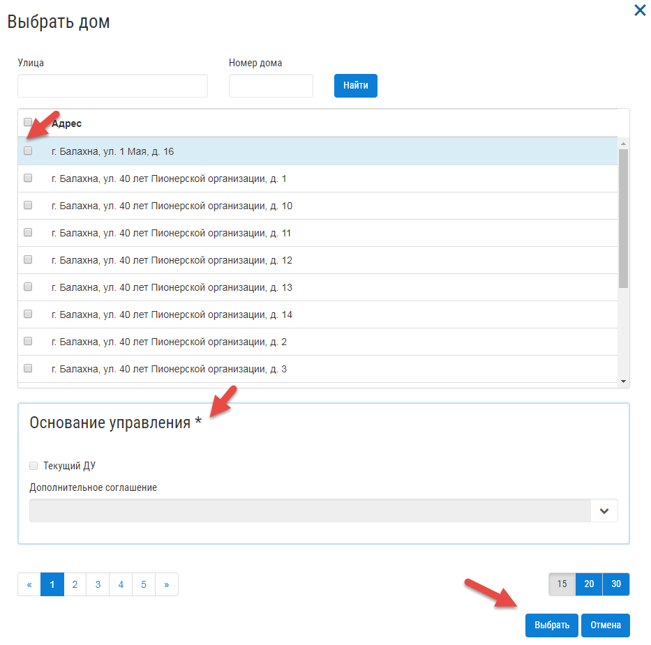
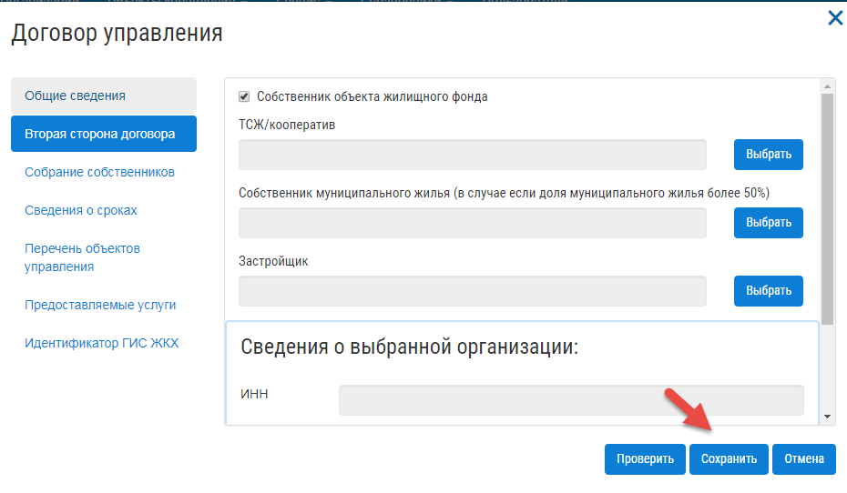
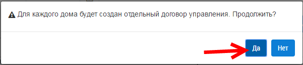

По договору управления
------------------------------
Добавить договор управления можно двумя способами:

* Из журнала "Договоры управления"

Для добавления договора управления, нажмите на кнопку «Добавить договор».

.. image:: ../_images/04-management-agreements/28.png

На вкладке «Перечень объектов управления», прикрепите многоквартирный дом/дома, которые относятся к создаваемому договору управления. Для этого нажмите на кнопку «Выбрать дом».

.. image:: ../_images/04-management-agreements/29.png

В открывшемся списке выберите МКД и нажмите кнопку сохранить.

После заполнения всех вкладок «Договора управления», нажмите кнопку «Сохранить».

Сохраненный договор управления появится в журнале "Договоры управления".

* Из журнала "МКД"

Добавить договор управления для многоквартирного дома, можно в журнале «МКД». Для этого перейдите в раздел «МКД». Выберете из списка многоквартирный дом/список многоквартирных домов, для которого требуется создать договор управления. Нажмите на кнопку «Создать договор управления».

.. image:: ../_images/04-management-agreements/32.png

Подтвердите создание договоров управления, нажав на кнопку «Да».

После автоматического обновления журнала, для выбранных домов отобразятся созданные договоры управления.

.. image:: ../_images/04-management-agreements/34.png

Для редактирования договора управления, нажмите кнопку редактирования. 

.. image:: ../_images/04-management-agreements/35.png

В открывшейся форме внесите необходимые изменения и нажмите кнопку «Сохранить».

.. image:: ../_images/04-management-agreements/36.png

Отредактировать договор управления вы можете из журнала МКД, открыв напротив дома, договор управления, который требуется изменить. 

.. image:: ../_images/04-management-agreements/37.png

