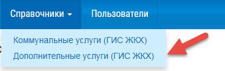
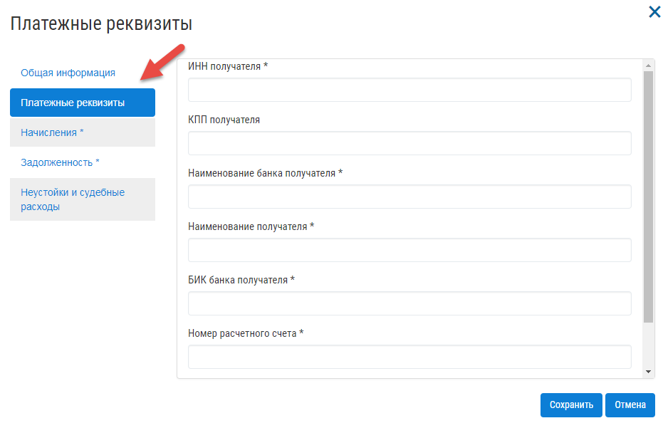
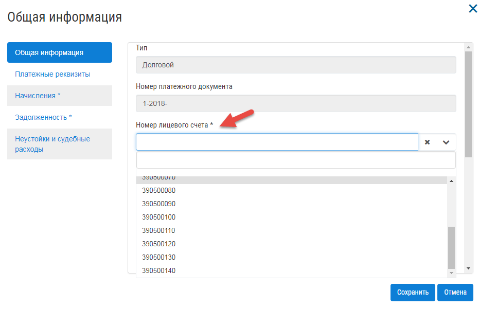

Работа в журнале «Справочники»
~~~~~~~~~~~~~~~~~~~~~~~~	

**Работа с журналом «Справочники» доступна для пользователей с ролями «Администратор», «Экономист», «Бухгалтер», «Инженер», «Пользователь».** 

Для размещения информации по **коммунальным услугам**, по  структуре ГИС ЖККХ следует: 

1. Выбрать в верхнем меню пункт «Справочники» -> «Коммунальные услуги (ГИС ЖКХ)».

	
2. Нажать кнопку «Добавить услугу».

.. image:: ../_images/04-management-agreements/64.png

3. Заполнить поля открывшейся формы.

4. Нажать кнопку «Сохранить»

.. image:: ../_images/04-management-agreements/65.png	

Услуга отобразится в журнале «Коммунальные услуги»

.. image:: ../_images/04-management-agreements/66.png

Для размещения информацию по **дополнительным услугам** следует: 

1. Выбрать в верхнем меню пункт «Справочники» -> «Дополнительные услуги (ГИС ЖКХ)».

2. Нажать кнопку «Добавить услугу».

.. image:: ../_images/04-management-agreements/68.png

3. Заполнить поля открывшейся формы.

4. Нажать кнопку «Сохранить»

.. image:: ../_images/04-management-agreements/69.png	

Услуга отобразится в журнале «Дополнительные услуги».

.. image:: ../_images/04-management-agreements/71.png	

Если было выполнено получение данных по МКД с Реформы ЖКХ, дополнительные услуги будут заполнены автоматически, если на Реформе ЖКХ для МКД были указаны выполняемые услуги.

Для размещения информации по **коммунальным услугам**, по  структуре Реформы ЖКХ следует: 

1. Выбрать в верхнем меню «Справочники» - «Коммунальные услуги (Реформа ЖКХ)».

2. Для добавления коммунальной услуги, нажать на кнопку «Добавить услугу».

3. В открывшейся форме заполнить поля на вкладке «Общие сведения». При указании значения в поле «Поставщик ресурсов УО» галочки, в блоке «Лицо, осуществляющее поставку коммунального ресурса» будет автоматически заполнены поля, данными организации, которая в журнале «Организации», содержится первой в списке.

4. Заполнить тарифы и нормативы на вкладке «Тарифы и нормативы».

5. Для добавления тарифа нажать на кнопку добавления. 

6. В открывшейся форме заполнять информацию о тарифе и нажать кнопку «Сохранить».

По аналогии, заполнить информацию в таблицах «Норматив потребления коммунальной услуги в жилых помещениях» и «Норматив потребления коммунальной услуги на общедомовые нужды».

7. После заполнения всей необходимой информации нажать кнопку «Сохранить». Добавленная услуга появится в журнале.

Для размещения информации по **выполняемым услугам**, по  структуре ГИС ЖККХ следует: 

1. Выбрать в верхнем меню «Справочники» - «Выполняемые услуги (Реформа ЖКХ)»

2. Для добавления выполняемой услуги, нажать на кнопку «Добавить услугу».

3. В открывшейся форме заполнить поля и нажать на кнопку «Сохранить». Добавленная услуга появится в журнале.

Работа в журнале «Организации»
~~~~~~~~~~~~~~~~~~~~~~~~~~~~~~~~

**Работа с журналом «Организации» доступна для пользователей с ролями «Администратор», «Экономист», «Бухгалтер», «Пользователь».** 

**Для заполнения данных по организации следует:**

1. Перейти в раздел «Организации».

	.. image:: ../_images/04-management-agreements/0.png

2. Нажать кнопку «Добавить организацию».

	.. image:: ../_images/04-management-agreements/1.png

3. Заполнить поля открывшейся формы сведениями об организации. 

Для добавления услуг, предоставляемых организацией, открыть раздел «Предоставляемые услуги». 
После заполняения данного раздела вы сможете добавить перечень созданных услуг в договор управления, для каждого многоквартирного дома, находящегося в управлении.
Для добавления всех услуг из справочника «Коммунальные услуги», в таблицу «Виды КУ», нажать на кнопку «Добавить все». 

Для добавления услуг из справочника «Коммунальные услуги», в таблицу «Виды КУ», нажать на кнопку добавления.

.. image:: ../_images/04-management-agreements/73.png

Выбрать услуги из списка в открывшейся форме. Нажать кнопку «Добавить».

Для добавления всех услуг из справочника «Дополнительные услуги» нажать на кнопку «Добавить все»

Для добавления услуг из справочника «Дополнительные услуги» нажать на кнопку добавления.

Выбрать услуги из списка в открывшейся форме. Нажать кнопку «Добавить».

.. image:: ../_images/04-management-agreements/77.png

После добавления предоставляемых услуг, обязательным шагом является синхронизация справочников, используемых в Управдом ЖКХ и справочниках ГИС ЖКХ.
Для синхронизации справочников с ГИС ЖКХ, требуется заполнить поле «Код организации в ГИС ЖКХ». Код организации формируется в личном кабинете после делегирования УО прав доступа на размещение данных, опрератору ИС.
Для просмотра идентификатора ИС, в личном кабинете ГИС ЖКХ откройте «Администрирование» -> «Информационные системы»

.. image:: ../_images/04-management-agreements/88.png

В таблице «Информационные системы» можно посмотреть идентификатор информационной системы. Его требуется скопировать и добавить в профиль организации в Управдом ЖКХ.

После заполнения индентификатора организации, можно выполнить процесс синхронизации справочников услуг с ГИС ЖКХ. Синхронизация справочников позволяет получить актуальный состав предоставляемых организацией услуг, для их последующего использования.
При синхронизации, услуги, которые были добавлены в личном кабинете ГИС ЖКХ, будут загружены в Управдом ЖКХ, и наоборот. Если в Управдом ЖКХ были удалены услуги, то после синхронизации они будут также удалены из справочников в ГИС ЖКХ.
Если во время синхронизации справочников возникли ошибки, выполните синхронизацию повторно.

Для этого выберите организацию из журнала «Организации».

.. image:: ../_images/04-management-agreements/86.png

Нажмите кнопку «Синхронизировать справочники».

.. image:: ../_images/04-management-agreements/87.png

4. Нажать кнопку «Сохранить».

	.. image:: ../_images/04-management-agreements/78.png

Теперь, синхронизированные услуги можно использовать как для формирования списка услуг в ДУ, так и для формирования платежных документов.

Работа в журнале «МКД»
~~~~~~~~~~~~~~~~~~~~~~~~

**Работа с журналом «МКД» доступна для пользователей с ролями «Администратор», «Экономист», «Бухгалтер», «Инженер», «Пользователь».** 

**Для заполнения данных по многоквартирному дому следует:** 

1. Перейти в раздел «МКД».

	.. image:: ../_images/04-management-agreements/53.png

2. Нажать кнопку «Добавить дом».

	.. image:: ../_images/04-management-agreements/15.png

3. Заполнить поля открывшейся формы.

4. Нажать кнопку «Сохранить».

	.. image:: ../_images/04-management-agreements/50.png

5. Выбрать управляющую организацию (УО):   

	- Если в системе не зарегистрировано ни одной УО, то данный шаг отсутствует.
	
	- Если в системе зарегистрирована одна УО, то она выбирается для МКД автоматически.
	
	- Если в системе зарегистрированы две и более УО, то необходимо выбрать УО из выпадающего списка и нажать кнопку «Добавить».

	.. image:: ../_images/04-management-agreements/51.png	

6. Заполнить обязательные поля во вкладке «Общие информация»:

	.. image:: ../_images/04-management-agreements/52.png

	для заполнения адреса:
	
	a. Нажать кнопку «Редактирование».
	
	.. image:: ../_images/04-management-agreements/55.png
	
	b. Внести корректировки, затем нажать на кнопку «Сохранить». 
	
	.. image:: ../_images/04-management-agreements/56.png
	
7. Заполнить обязательные поля во вкладке «Управление».

	.. image:: ../_images/04-management-agreements/62.png

8. Заполнить поля во вкладке «Данные по дому». 

	.. image:: ../_images/04-management-agreements/61.png
	
	Информация, заполненная на вкладке «Данные по дому» выгружается в шаблон excel по структуре ГИС ЖКХ и может быть размещена при загрузке шаблона в личном кабинете компании ГИС ЖКХ.
	
9. Заполнить поля во вкладке «Подъезды».

Для добавления подъезда, необходимо нажать на кнопку «Добавить подъезд»

	.. image:: ../_images/04-management-agreements/95.png
	
В открывшейся форме создания подъезда, необходимо заполнить все обязательные поля. 

	.. image:: ../_images/04-management-agreements/96.png
		
Если информация по подъезду была добавлена ошибочно, можно удалить подъезд, нажав на кнопку удаления.	

	.. image:: ../_images/04-management-agreements/97.png	
	
Для сохранения подъезда, нажать кнопку «Сохранить».

**Важно!** При автоматическом создании помещений они будут отнесены к тому подъезду,в интервал которого входит номер создаваемого помещения, включая значения указанные в полях «Помещения с» - «По».

	
10. Заполнить вкладку «Жилые помещения».
	
Для добавления помещения нажать на кнопку создания.
	
	.. image:: ../_images/04-management-agreements/98.png		
	
Заполнить поля открывшейся формы.
	
	.. image:: ../_images/04-management-agreements/99.png	
	
При указании номера помещения, системой будет автоматически определен номер подъезда, если ранее был создан подъезд. 

	.. image:: ../_images/04-management-agreements/100.png	
	
После заполнения всей информации, нажать на кнопку «Сохранить».

	.. image:: ../_images/04-management-agreements/101.png	

Для редактирования группы помещений, выбрать помещения из списка и нажать на кнопку «Изменить».

	.. image:: ../_images/04-management-agreements/102.png	

**Важно!** Если при печати квитанций в системе ранее не было создано помещение, оно будет создано автоматически с типом «Жилое». При изменении общей площади помещения в квитанции, оно будет обновлено в карточке помещения и подсвечено цветом.

	.. image:: ../_images/04-management-agreements/116.png	
	
11. Заполнить вкладку «Нежилые помещения».

	.. image:: ../_images/04-management-agreements/103.png	

Для создания помещения нажать на кнопку создания. Для редактирования группы помещений, выбрать помещения из списка и нажать на кнопку «Изменить».
В карточке нежилого помещения требуется указать номер договора (код объекта), используемый для последующей работы с объемами потребления ИПУ.

12. Заполнить вкладку «Коммунальные помещения»
	
Для добавления помещения нажать кнопку создания.

 	.. image:: ../_images/04-management-agreements/104.png	

Заполнить поля открывшейся формы, нажать кнопку «Сохранить».

 	.. image:: ../_images/04-management-agreements/105.png	
	
После добавления коммунального помещения, будет доступна вкладка «Комнаты».

Для добавления комнаты, требуется перейти на вкладку «Комнаты» и нажать на кнопку создания.

 	.. image:: ../_images/04-management-agreements/106.png	

Заполнить поля открывшейся формы с указанием коммунального помещения, к которому относится комната.

 	.. image:: ../_images/04-management-agreements/107.png		
	
После добавления комнат для коммунального помещения, Общая площадь коммунального помещения будет соответствовать сумме общих площадей комнат, которые относятся к данному коммунальному помещению.
	
После заполнения всех данных по многоквартирному дому нажать кнопку «Сохранить», для сохранения внесенных изменений.

Работа в журнале «Договоры управления»
~~~~~~~~~~~~~~~~~~~~~~~~

**Работа с журналом «Договоры управления» доступна для пользователей с ролями «Администратор», «Экономист», «Пользователь».** 
**Примечание:** работа с договорами управления не доступна пользователям с ролями **«Бухгалтер»** и **«Инженер»**.

**Добавить договор управления можно двумя способами:**

- Из журнала «МКД».

- Из журнала «Договоры управления».

В первом случае, при создании из журнала «МКД», пользователь сразу может увидеть список домов, для которых требуется создать договоры управления. 
Во втором случае, при создании из журнала «Договоры управления», необходимо открыть (добавить) договор управления, перейти во вкладку «Перечень объектов управления» и выбрать МКД к управлению.

**Из журнала «МКД»:**

1. Перейти в журнал «МКД». 

2. Выбрать из списка многоквартирный дом/список многоквартирных домов, для которого требуется создать договор управления. 

3. Нажать на кнопку «Создать договор управления».

	.. image:: ../_images/04-management-agreements/32.png

4. При создании ДУ для нескольких МКД, необходимо подтвердить создание договоров управления нажатием кнопки «Да».

	.. image:: ../_images/04-management-agreements/33.png

После автоматического обновления журнала для выбранных домов отобразятся созданные договоры управления.

	.. image:: ../_images/04-management-agreements/34.png

**Из журнала «Договоры управления»:**

1. Перейти в журнал «Договоры управления».

	.. image:: ../_images/04-management-agreements/5.png

2. Нажать кнопку «Добавить договор».

	.. image:: ../_images/04-management-agreements/28.png
	
3. Заполнить поля. Прикрепить документы договора управления в блоке «Договор на управление и приложения». Для добавления дополнительных соглашений, прикрепить документы в блоке «Дополнительное соглашение». 
Добавленные дополнительные соглашения, появятся в списке при выборе основания предоставления услуг. 
Если на вкладке «Вторая сторона договора» поставлена галочка в поле «Собственник объекта жилищного фонда», то на вкладке «Общие сведения» необходимо прикрепить файл в блок «Реестр собственников, подписавших договор» 

4. На вкладке «Перечень объектов управления» нажать кнопку «Выбрать дом» для того, чтобы прикрепить многоквартирный(-ые) дом(-а), которые относятся к создаваемому договору управления. 
При добавлении договора управления, необходимо указать основание, по умолчанию, устанавливается значение «Текущий ДУ».

	.. image:: ../_images/04-management-agreements/29.png
	
5. В открывшемся списке выбрать МКД.

6. Нажать кнопку «Выбрать».

	.. image:: ../_images/04-management-agreements/30.png

7. Заполнить вкладку «Предоставляемые услуги».

Раздел «Предоставляемые услуги» заполняется услугами организации, которые предоставляются для МКД, находящимися в управлении организации. 
**Важно!** Перед добавлением услуг, необходимо проверить синхронизированы ли справочники в ГИС ЖКХ. 
Заполненные дополнительные и коммунальные услуги в договоре управления, будут использоваться при автоматическом создании платежных документов.
 
Для заполнения таблиц: «Виды КУ», «Дополнительные услуги», необходимо нажать на кнопку добавления для выбора одной услуги или нажать на кнопку «Выбрать все», в результате чего в таблицу будут подтянуты все услуги, которые были указаны в Организации в разделе «Предоставляемые услуги».

	.. image:: ../_images/04-management-agreements/90.png

При нажатии на кнопку добавления коммунальных услуг, будет отображена форма с услугами. В открывшемся списке, отметить услуги, которые необходимо добавить. Указать основание предоставления услуг. Нажать кнопку «Добавить».

	.. image:: ../_images/04-management-agreements/91.png
	
Для добавления всех услуг в таблицу, нажать на кнопку «Добавить все». В открывшемся окне указать основание предоставления услуг. Нажать кнопку «Сохранить».

	.. image:: ../_images/04-management-agreements/92.png
	
При нажатии на кнопку добавления дополнительных услуг, будет отображена форма с услугами. В открывшемся списке, отметить услуги, которые необходимо добавить. Указать основание предоставления услуг. Нажать кнопку «Добавить».

	.. image:: ../_images/04-management-agreements/93.png
	
В открывшемся списке, отметить услуги, которые необходимо добавить. Указать основание предоставления услуг. Нажать кнопку «Добавить».

	.. image:: ../_images/04-management-agreements/94.png

Для добавления всех услуг в таблицу, нажать на кнопку «Добавить все». В открывшемся окне указать основание предоставления услуг. Нажать кнопку «Сохранить».	

Массовое добавление услуг в договоры управления доступно по кнопке «Изменить». Для этого требуется выбрать ДУ в журнале «Договоры управления», затем нажать кнопку «Изменить».

	.. image:: ../_images/04-management-agreements/109.png

В открывшейся форме указать перечень услуг, который требуется добавить в договор управления.

	.. image:: ../_images/04-management-agreements/110.png
	
Затем нажать кнопку «Добавить». Подтвердить данное действие. Добавляемые услуги по умолчанию будут добавлены с основанием предоставления услуг «Текущий договор управления».
	
8. Заполнение вкладки «Идентифкатор ЖКУ»

Идентификатор ДУ в ГИС ЖКХ - используется для хранения последней версии договора управления размещенного в ГИС ЖКХ, для возможности последующей публикации данных по ДУ в ГИС ЖКХ. 

Получить идентификатор договора управления с ГИС ЖКХ можно только в том случае, если договор управления размещен в ГИС ЖКХ. Для обновления идентификатора ДУ с ГИС ЖКХ, необходимо нажать на кнопку «Получить данные по идентификатору».

	.. image:: ../_images/04-management-agreements/108.png

После выполнения операции обновления будет получена последняя версия идентификатора ДУ.

9.После заполнения всех вкладок «Договора управления» нажать кнопку «Сохранить», для сохранения изменений.

	.. image:: ../_images/04-management-agreements/31.png

Сохраненный договор управления появится в журнале «Договоры управления».

Для выполнения проверки на заполненность требуемых полей, необходимо нажать на кнопку «Проверить» в режиме редактирования ДУ.

	.. image:: ../_images/04-management-agreements/31.png

Если не все рекомендуемые к заполнению поля будут заполнены, будет отображено информационное сообщение со списком данных полей.
	
**Отредактировать договор управления можно двумя способами:**

- Из журнала «МКД», нажав значок договора управления.

- Из журнала «Договоры управления», нажав кнопку «Редактировать» .

**Для редактирования договора управления необходимо:**

1. Перейти в соответствующий раздел («МКД» или «Договоры управления»).

2. Выбрать договор управления для редактирования:

	- в разделе «МКД»;
	
	.. image:: ../_images/04-management-agreements/57.png
	
	- в разделе «Договоры управления».
	
	.. image:: ../_images/04-management-agreements/58.png
	
3. Внести изменения.

4. Нажать кнопку «Сохранить».

Работа в журнале «Платежные документы»
~~~~~~~~~~~~~~~~~~~~~~~~

1. Перейти в журнал «Платежные документы».

.. image:: ../_images/04-management-agreements/79.png

2. Для создания платежного документа **с типом «Текущий»** нажать на кнопку «Создать документ» ->  «Текущий».

Заполнить поля открывшейся формы. Поля и блоки отмеченные * , обязательны для заполнения. Для платежного документа с типом «Текущий», в блоке «Начисления» обязательно должны быть указаны услуги. 
Если организация предостваляет только коммунальные услуги, необходимо заполнить блок «Коммунальные услуги».
Если предоставляются только дополнительные услуги, необходимо заполнить блок «Дополнительные услуги». 

Номер платежного документа формируется как: номер лицевого счета + дата выставления платежного документа (мм.гггг) + 0 (если тип платежного документа «Текущий»).

При выборе номера лицевого счета, значение адреса заполнится автоматически. 

.. image:: ../_images/04-management-agreements/80.png

Поля «Месяц» и «Год» автозаполняются значениями текущего года и месяца. Поля «Общая площадь для ЛС», «Кол-во проживающих», «Жилая площадь», «Отапливаемая площадь» автозаполняются значениями по выбранному лицевому счету.

Если в системе, для выбранного лицевого счета не создан дом и договор управления (с указанием предоставляемых услуг), а ткаже управляющая организация, которая управляет домом, платежный документ не будет создан.

Раздел «Платежные реквизиты» будет автозаполнен данными организации, которая управляет многоквартирным домом, адрес которого указан в платежном документе.
 

Раздел «Начисления» будет заполнен автоматически, услугами из договора управления, если в договоре указаны услуги для данного адреса. 

.. image:: ../_images/04-management-agreements/82.png

Обязательные для заполнения поля и разделы отмечены звездочкой.

3. Для создания платежного документа **с типом «Долговой»** нажать на кнопку «Создать документ» -> «Долговой».

Заполнить поля открывшейся формы. Поля и блоки отмеченные * , обязательны для заполнения. Для платежного документа с типом «Долговой», в блоке «Задолженность» обязательно должны быть указаны данные по задолженности. 
Если данные по задолженности только по коммунальным услугам, необходимо заполнить блок «Коммунальные услуги».
Если данные по задолженности только по дополнительным услугам, неоходимо заполнить блок «Дополнительные услуги».   

Номер платежного документа формируется как: номер лицевого счета + дата выставления платежного документа (мм.гггг) + 1 (если тип платежного документа «Долговой»).

При выборе номера лицевого счета, значение адреса заполнится автоматически. 

Поля «Месяц» и «Год» автозаполняются значениями текущего года и месяца. Поля «Общая площадь для ЛС», «Кол-во проживающих», «Жилая площадь», «Отапливаемая площадь» автозаполняются значениями по выбранному лицевому счету.

Если в системе, для выбранного лицевого счета не создан дом, платежный документ не будет создан.

Раздел «Платежные реквизиты» будет автозаполнен данными организации, которая управляет многоквартирным домом, адрес которого указан в платежном документе.

Раздел «Задолженность» будет заполнен автоматически, услугами из договора управления, если в договоре указаны предоставляемые услуги для данного адреса.

.. image:: ../_images/04-management-agreements/85.png

4. Для сохранения платежного документа нажмите кнопку «Сохранить».

.. image:: ../_images/04-management-agreements/83.png

Для автоматического создания платежного документа в системе, требуется выполнить печать с помощью принтера ГИС ЖКХ. Платежный документ будет создан в системе автоматически, если в системе созданы: МКД, помещение, лицевой счет, договор управления.
При автоматическом создании платежного документа, услуги, которые указаны для передаваемого адреса в квитанции, будут определены из договора управления. Если в платежном документе пристуствуют услуги, которые не были указаны в договоре управления как коммунальные или дополнительные, они будут определены в блок «Плата за содержание жилого помещения».
Услуги из блока «Плата за содержание жилого помещения» при публикации передаются в ГИС ЖКХ в рамках услуги «Плата за содержание жилого помещения». 

Если после автоматического создания платежного документа, у него отображается статус «Ошибка в рассчетах», необходимо проверить корректность передаваемых сумм в печатаемом платежном документе. Для этого, требуется открыть форму просмотра данного платежного документа у которого произошли ошибки в расчетах.

В открывшейся форме просмотра будет указана сумма «Итого к оплате», которая была получена при считывании квитанции, а также «Контрольная сумма» - сумма, полученная при подсчете значений из поля «Начислено». При получении данной ошибки, необходимо скорректировать квитанцию, отправляемую на печать и выполнить повторную печать платежного документа.

Для проверки созданного платежного документа в части начислений, требуется выбрать платежный документ из журнала и нажать кнопку «Проверить».

Работа в журнале «Журнал событий»
~~~~~~~~~~~~~~~~~~~~~~~~

**Работа с журналом «Журнал событий» доступна для пользователей с ролями «Администратор», «Экономист», «Бухгалтер», «Инженер», «Пользователь».** 
Информацию по загрузке, обновлению, публикации данных можно посмотреть в разделе «Журнал событий». Для этого, требуется выбрать в меню «Сервис» - «Журнал событий».

Если при публикации документов в ГИС ЖКХ возникли ошибки, они будут отображены в данном журнале. Из журнала «Журнал событий» можно открыть документ на редактирование двойным кликом. После чего будет открыта форма редактирования.
После внесения изменений и их сохранения, можно выполнить повторную публикацию документа в ГИС ЖКХ. Для этого требуется выбрать документ (группу документов) и нажать кнопку «Отправить повторно».

Для поиска информации в журнале, необходимо воспользоваться фильтрами и нажать кнопку «Найти».

При выгрузке данных, например архива, содержащего данные по лицевым счетам, скачивание данного файла доступно из журнала «Журнал событий». Для того, чтобы скачать архив на ПК, необходимо кликнуть по нему и выбрать папку, в которую требуется выполнить сохранение архива.

Работа в журнале «Администрирование»
~~~~~~~~~~~~~~~~~~~~~~~~
**Работа с журналом «Журнал событий» доступна для пользователей с ролями «Администратор».** 
Как получить данные с Реформы ЖКХ по МКД и Организации описано в `разделе 2.1 <http://upravdomgkh.readthedocs.io/ru/latest/02-work-section-mkd/2.1.html>`_.
Как скачать драйвер, описано в разделе  `разделе 3 <http://upravdomgkh.readthedocs.io/ru/latest03-employment-section-organization/index.html>`_.

Работа в журнале «Мониторинг статусов обработки квитанций»
~~~~~~~~~~~~~~~~~~~~~~~~~~~~~~~~~~~~~~~~~~~~~~~~~~~~~~~~~~~~
**Работа с журналом «Журнал событий» доступна для пользователей с ролями «Администратор».** 

В данном журнале отображается прогресс загрузки платежных документов в систему.
Если при печати платежного документа вознкила ошибка «Не пройдент ФЛК», требуется выполнить повторную печать нераспознанной квитанции. 
При получении ошибки «Ошибка обработки», «Ошибка загрузки в Управдом» требуется выбрать платежные документы из журнала «Мониторинг статусов обработки квитанций» и выполнить «Перезапуск с первого этапа».
Если в системе не был созданы: Организация, МКД, договор управления, то в столбце «Информация об ошибке» будет отображена информация о том, какие из документов не созданы в системе.
