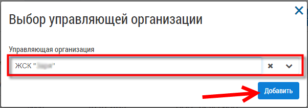

Внесение данных вручную
-------------------------
По организации
~~~~~~~~~~~~~~

**Для ручного заполнения данных по организации следует**

1. Перейти в раздел «Организации».

	.. image:: ../_images/04-management-agreements/0.png

2. Нажать кнопку «Добавить организацию».

	.. image:: ../_images/04-management-agreements/1.png

3. Заполнить поля открывшейся формы сведениями об организации.

4. Нажать кнопку «Сохранить».

	.. image:: ../_images/04-management-agreements/2.png

По многоквартирному дому
~~~~~~~~~~~~~~~~~~~~~~~~

**Для ручного заполнения данных по многоквартирному дому следует:** 

1. Перейти в раздел «МКД».

	.. image:: ../_images/04-management-agreements/53.png

2. Нажать кнопку «Добавить дом».

	.. image:: ../_images/04-management-agreements/15.png

3. Заполнить поля открывшейся формы.

4. Нажать кнопку «Добавить дом к управлению».

	.. image:: ../_images/04-management-agreements/50.png

5. Выбрать из выпадающего списка управляющую организацию.

6. Нажать кнопку «Добавить».

7. Заполнить обязательные поля в открывшейся форме:

	.. image:: ../_images/04-management-agreements/52.png

	для заполнения адреса:
	
	a. Нажать кнопку «Редактирование».
	
	.. image:: ../_images/04-management-agreements/55.png
	
	b. Заполнить поля. 
	
	.. image:: ../_images/04-management-agreements/56.png

8. Нажать кнопку «Сохранить».
	
После этого дом добавится в журнал «МКД».

**Для редактирования «МКД» необходимо:**

1. Перейти в раздел «МКД».

2. Нажать кнопку «Редактирование» напротив требуемого дома (или двойным нажатием левой кнопки мыши по строке).

	.. image:: ../_images/04-management-agreements/54.png

3. Внести необходимые изменения.

4. Нажать кнопку «Сохранить».

По договору управления
~~~~~~~~~~~~~~~~~~~~~~~~
Добавить договор управления можно двумя способами:

- Из журнала «МКД».

- Из журнала «Договоры управления».

В первом случае пользователь сразу может увидеть список домов, для которых требуется создать договоры управления. Во втором случае необходимо открыть (добавить) договор управления, перейти во вкладку «Перечень объектов управления» и выбрать список домов.

**Из журнала «МКД»:**

Для того, чтобы добавить договор управления для многоквартирного дома, необходимо:
 
1. Перейти в раздел «МКД». 

2. Выбрать из списка многоквартирный дом/список многоквартирных домов, для которого требуется создать договор управления. 

3. Нажать на кнопку «Создать договор управления».

	.. image:: ../_images/04-management-agreements/32.png

4. Подтвердить создание договоров управления нажатием кнопки «Да».

	.. image:: ../_images/04-management-agreements/33.png

После автоматического обновления журнала для выбранных домов отобразятся созданные договоры управления.

	.. image:: ../_images/04-management-agreements/34.png

**Из журнала «Договоры управления»:**

1. Перейти в раздел «Договоры управления».

	.. image:: ../_images/04-management-agreements/5.png

2. Нажать кнопку «Добавить договор».

	.. image:: ../_images/04-management-agreements/28.png

3. На вкладке «Перечень объектов управления» нажать кнопку «Выбрать дом» для того, чтобы прикрепить многоквартирный дом/дома, которые относятся к создаваемому договору управления. 

	.. image:: ../_images/04-management-agreements/29.png

4. В открывшемся списке выбрать МКД.

5. Нажать кнопку «Сохранить».

	.. image:: ../_images/04-management-agreements/30.png

6. После заполнения всех вкладок «Договора управления» нажать кнопку «Сохранить».

	.. image:: ../_images/04-management-agreements/31.png

Сохраненный договор управления появится в журнале «Договоры управления».

Отредактировать договор управления можно двумя способами:

- Из журнала «МКД».

- Из журнала «Договоры управления».

**Для редактирования договора управления необходимо:**

1. Перейти в соответствующий раздел («МКД» или «Договоры управления»).

2. Выбрать договор управления для редактирования:

	- в разеделе «МКД»;
	
	.. image:: ../_images/04-management-agreements/57.png
	
	- в разделе «Договоры управления».
	
	.. image:: ../_images/04-management-agreements/58.png
	
3. Внести изменения.

4. Нажать кнопку «Сохранить».

