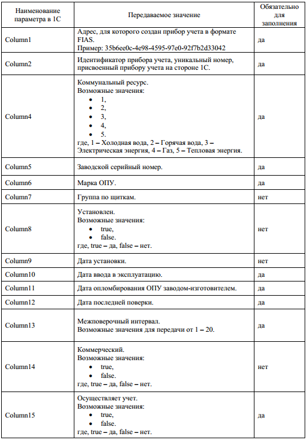
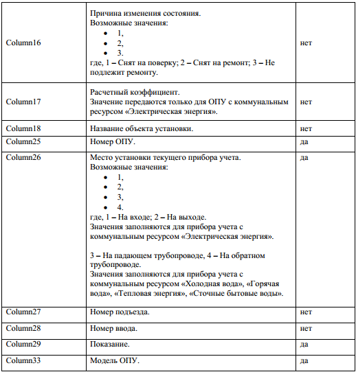
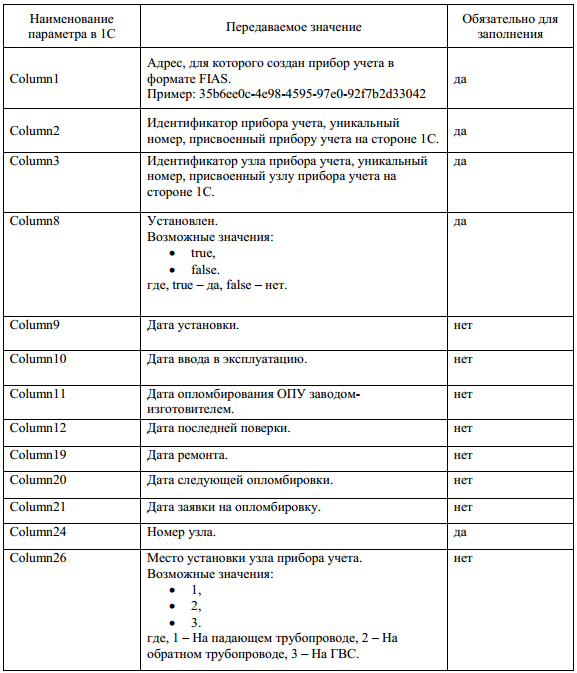

Подготовка архива для загрузки данных 
-------------------------------------

Подготовка архива, содержащего данные по общедомовым приборам учета
~~~~~~~~~~~~~~~~~~~~~~~~~~~~~~~~~~~~~~~~~~~~~~~~~~~~~~~~~~~~~~~~~~~~

Для создания/обновления данных по общедомовым приборам учета требуется выполнить подготовку загружаемого архива. Подготовка архива должна удовлетворять следующему набору условий:

1.	Загружаемый архив должен иметь расширение .zip.
2.	Архив должен содержать файлы формата .json.
3.	Файл .json формата должен содержать набор данных следующей конструкции: 

									**ColomnN : «Значение»**    
где:	

#.	ColomnN – наименование параметра в 1С, хранящего данные по ОПУ;
#.	«Значение» – значение, раскрывающее информацию по прибору учета;

В таблице, указанной ниже, приведена структура загружаемого файла формата .json для создания/обновления данных в системе.

Подготовка архива, содержащего данные по узлам общедомового приборам учета
~~~~~~~~~~~~~~~~~~~~~~~~~~~~~~~~~~~~~~~~~~~~~~~~~~~~~~~~~~~~~~~~~~~~~~~~~~

При подготовке данных по узлам общедомовых приборов учета, архив должен соответствовать условиям, описанным вsit. Структура файла, формата .json, содержащего данные по узлам ОПУ представлена в таблице ниже.

