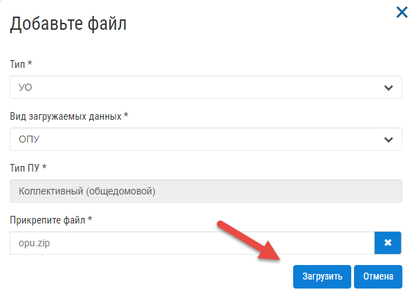
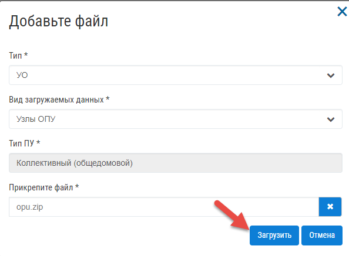

Загрузка данных по общедомовым приборам учета
---------------
**Примечание: Работа с журналом доступна для пользователя с ролями: «Администратор», «Инженер».**

Загрузка ОПУ
~~~~~~~~~~~~~~~~~~~~~~~~~~~~~~~~~~~~

Для создания/обновления общедомового прибора учета в журнале «Приборы учета» необходимо выбрать в верхнем меню «Приборы учета» – «ОПУ».

Для загрузки архива, требуется нажать на кнопку «Загрузить архив».

Заполнить поля формы, указав в поле «Вид загружаемых данных» значение «ОПУ». Для загрузки данных в систему, требуется нажать кнопку «Загрузить».

Для того, чтобы обновить данные по прибору учета, необходимо повторно выполнить загрузку архива, содержащего данные по ОПУ, в которых значения «ID МКД» - Column1, «ID ОПУ» - Column2, «Коммунальный ресурс» - Column4 совпадали со значениями ранее созданного в Управдом ЖКХ прибора учета.
В процессе загрузки приборов учета в журнале «Общедомовые приборы учета» будет отображен процесс загрузки приборов учета. 
После того, как архив будет загружен в систему, появится окно содержащее сообщение об успешности загрузки приборов учета или с информацией о том, что не все приборы учета были загружены в систему.

При получении сообщения об ошибке загрузки, требуется обратиться к администратору для выявления причин по которым не была выполнена загрузка приборов учета. 

Загрузка узлов ОПУ
~~~~~~~~~~~~~~~~~~

Для создания/обновления общедомовых приборов учета в журнале «Приборы учета» необходимо выбрать в верхнем меню «Приборы учета» - «ОПУ».

Для загрузки архива, требуется нажать на кнопку «Загрузить архив» .

Заполнить поля формы, указав в поле «Вид загружаемых данных» значение «Узлы ОПУ». Для загрузки данных в систему, требуется нажать кнопку «Загрузить».

Для того, чтобы обновить данные по прибору учета, необходимо повторно выполнить загрузку архива, содержащего данные по узлу ОПУ, в котором значения «ID МКД» - Column1, «ID ОПУ» - Column2, «ID узла ОПУ» - Column3 совпадали со значениями ранее созданного в Управдом ЖКХ узла прибора учета.
В процессе загрузки узлов приборов учета в журнале «Общедомовые приборы учета» будет отображен процесс загрузки. После того, как архив будет загружен в систему, появится окно содержащее сообщение об успешности загрузки узлов приборов учета или с информацией о том, что не все узлы были загружены в систему.

При получении сообщения об ошибке загрузки, требуется обратиться к администратору для выявления причин по которым не была выполнена загрузка всех узлов. 