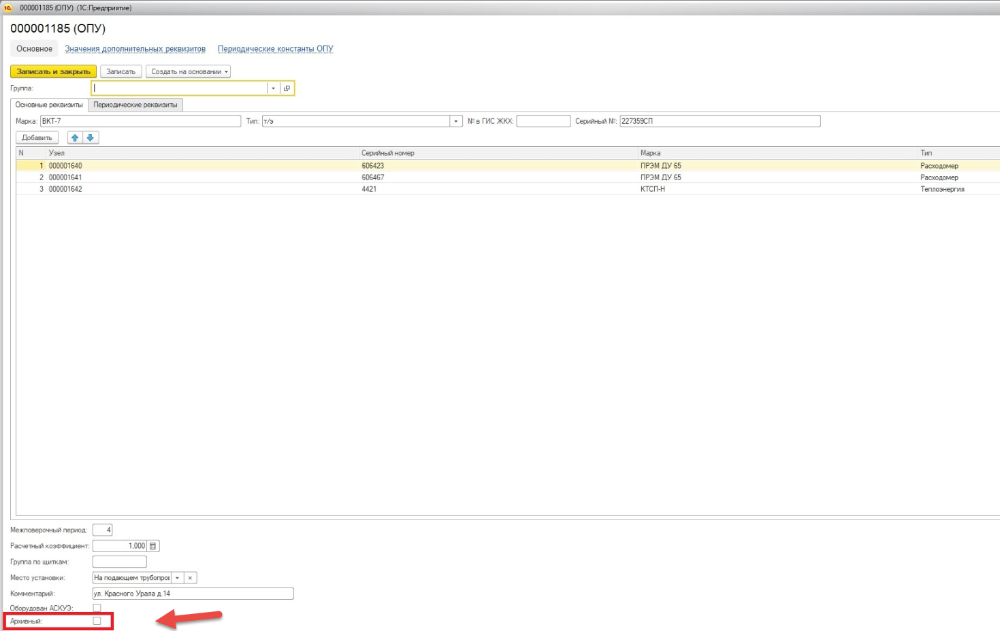
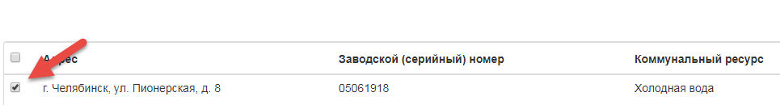
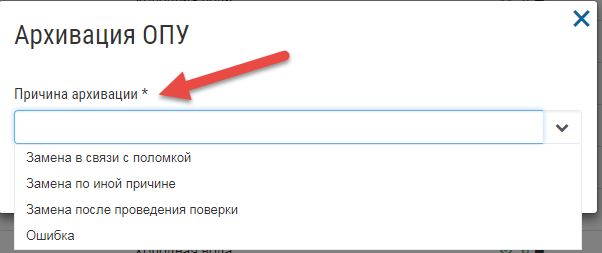
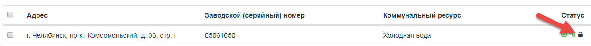

Архивация приборов учета в Системе
----------------------------------

Автоматическая архивация приборов учета
~~~~~~~~~~~~~~~~~~~~~~~~~~~~~~~~~~~~~~~

При загрузке архива содержащего данные по общедомовым приборам учета, будет выполнена автоматическая архивация приборов учета в Управдом ЖКХ, если для данных приборов учета в поле Column16, см. Таблица 1, указано значение = 3 (Не подлежит ремонту). 
При автоматической архивации в Управдом ЖКХ, в поле «Причина архивации» карточки ОПУ, будет указано значение «Замена в связи с поломкой».

Для присвоения статуса общедомового прибора учета «Архивный» в 1С, необходимо указать флаг «Архивный», выбрав данный ОПУ из списка.

После выгрузки такого прибора учета из 1С в файл формата .json, он будет в Column16 содержать значение = 3.

Ручная архивация приборов учета
~~~~~~~~~~~~~~~~~~~~~~~~~~~~~~~

Для архивации прибора учета вручную, требуется выбрать прибор учета для архивации, поставив галочку напротив прибора учета.

Затем нажмите кнопку «Архивировать» - «Без замены на другой ОПУ». В открывшемся окне, указать причину архивации ОПУ, нажать кнопку «Архивировать».

Для прибора учета будет выполнено архивирование, в журнале будет отображен статус «Архивный».

Для обновления статуса у прибора учета в ГИС ЖКХ, требуется его опубликовать. После успешной публикации, информация о статусе «Архивный» для данного ОПУ будет размещена в ГИС ЖКХ.