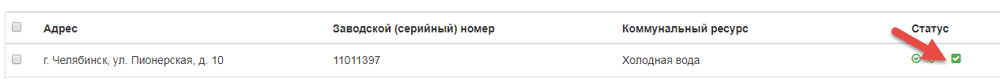

Возврат ОПУ после поверки
--------------------------
Выполнение возврата ОПУ после поверки требуется для того, чтобы актуализировать информацию по ранее размещенным ОПУ в ГИС ЖКХ, имеющих состояние «Снят на поверку» или «Снят на ремонт».

Выполнение операции «Вернуть ОПУ после поверки» возможно только для приборов учета, которые были опубликованы в ГИС ЖКХ и не были архивированы в Управдом ЖКХ, а также в ГИС ЖКХ. 

Если для возврата был выбран прибор учета, имеющий статус «Архивирован», пользователю будет отображено сообщение об ошибке.
Если для возврата был выбран прибор учета, который не был опубликован в ГИС ЖКХ, пользователю будет отображено сообщение об ошибке.

**Важно!** Для выполнения возврата прибора учета, на ГИС ЖКХ должен быть размещен договор управления для МКД, к которому относится данный прибор, с указанием коммунального ресурса, по данному прибору учета.

**Важно!** Возврат ОПУ после поверки не означает обновление данных по всему прибору учета. Выполнение возврата ОПУ учитывает передачу данных в ГИС ЖКХ по ряду полей, а именно:

#.	Дата начала поверки.
#.	Дата окончания поверки.
#.	Дата опломбирования прибора учета после поверки.
#.	Показание на начало поверки.
#.	Показание на окончание поверки.

Для обновления данных по прибору учета, требуется выполнить публикацию ОПУ в ГИС ЖКХ. 

**Важно!** Если возврат прибора учета был выполнен с ошибкой, то обновление информации в ГИС ЖКХ по данному прибору невозможно. Обновление данных по прибору учета станет возможным только после успешного выполнения операции «Выполнить возврат ОПУ после поверки».

Возврат прибора учета автоматически
~~~~~~~~~~~~~~~~~~~~~~~~~~~~~~~~~~~~

Для автоматического возврата прибора учета после поверки с ГИС ЖКХ, требуется внести изменения в поле «Дата последней поверки». 

**Важно!** Автоматический возврат прибора учета будет выполнен, если в поле Column12 см., в поле «Дата последней поверки» было внесено изменение. По умолчанию, причина поверки будет указана как «Плановая поверка».

Если возврат прибора учета будет выполнен успешно, для данного прибора учета будет отображен статус «Выполнен возврат».
Если во время выполнения возврата прибора учета произошла ошибка, для данного прибора учета будет отображен статус «Ошибка возврата». Выполнить возврат прибора учета в этом случае требуется вручную или автоматически, повторно изменив значение в поле «Дата последней поверки».

**Важно!** Если был выполнен возврат ОПУ, для которого в Управдом ЖКХ было загружено некорректное значение в поле «Дата последней поверки», после выполнения возврата ОПУ в ГИС ЖКХ, значение в поле «Дата последней поверки» может быть скорректировано датой больше переданной. Например, если была загружена «Дата последней поверки» = 12.08.17 и выполнен возврат, загружаемая дата для данного ОПУ в поле «Дата последней поверки» должна быть больше или равна 12.08.17.

Возврат прибора учета вручную
~~~~~~~~~~~~~~~~~~~~~~~~~~~~~

Для выполнения возврата ОПУ вручную, требуется выбрать ОПУ из журнала. Затем нажать на кнопку «Вернуть ОПУ после поверки». 

В открывшейся форме заполнить поля необходимыми значениями. По умолчанию на форме указано значение «Плановая поверка». Если поверка является внеплановой, требуется убрать галочку в поле «Плановая поверка». 

После заполнения всей информации, нажать кнопку «Вернуть прибор».

Если возврат прибора учета будет выполнен успешно, для данного прибора учета будет отображен статус «Выполнен возврат».

Если во время выполнения возврата прибора учета произошла ошибка, для данного прибора учета будет отображен статус «Ошибка возврата».

Выполнить возврат прибора учета в этом случае требуется вручную или автоматически, повторно изменив значение в поле «Дата последней поверки».