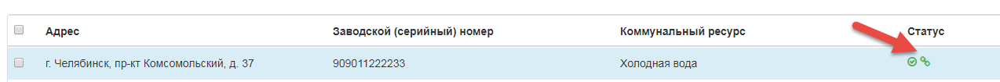
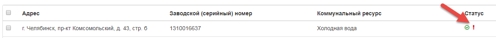

5.	Публикация ОПУ в ГИС ЖКХ
-----------------------------

Для публикации общедомового прибора учета в ГИС ЖКХ он не должен иметь статус «Архивный» в Управдом ЖКХ, а также «Дата следующей поверки», которая состоит из «Дата последней поверки» + «Межповерочный интервал» должна быть больше или равна текущей дате. 

Поле «Дата следующей поверки» не отображается на форме «Общедомовой прибор учета».

Для публикации прибора учета, требуется выбрать ОПУ в журнале «Общедомовые приборы учета» для публикации, нажать на кнопку «Опубликовать».

После успешной публикации прибора учета пользователю будет отображен статус «Отправлен» для данного прибора учета.

Если во время публикации произошла ошибка, для данного ОПУ будет отображен статус «Ошибка отправки».

