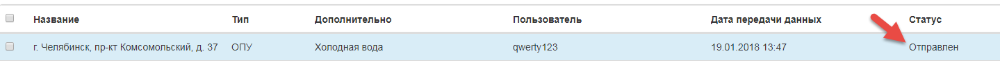
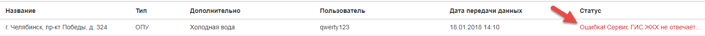

5.	Просмотр информации в Журнале событий по ОПУ
-----------------------------

Для просмотра информации по статусу отправки ОПУ в ГИС ЖКХ, требуется выбрать в верхнем меню «Сервис» -> «Журнал событий».

В случае успешной публикации прибора учета в ГИС ЖКХ в столбце «Статус» будет отображен статус «Отправлен».

В случае ошибки публикации прибора учета в ГИС ЖКХ в столбце «Статус» будет отображена информация об ошибке.

Если получена ошибка о том, что сервисы ГИС ЖКХ не отвечают, требуется повторить попытку публикации прибора учета позднее.

Если получена иная ошибка, необходимо обратиться к администратору. Возможно, в системе не создан МКД или передан некорректный адрес для загружаемого прибора учета.

