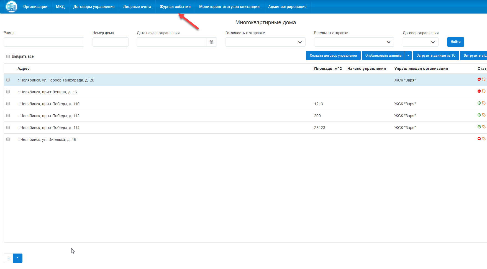
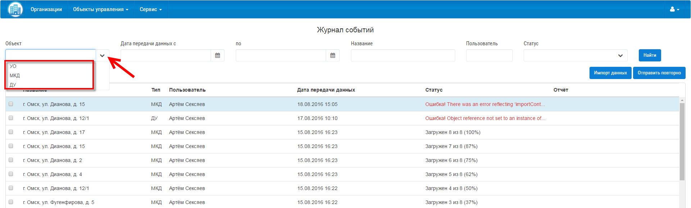
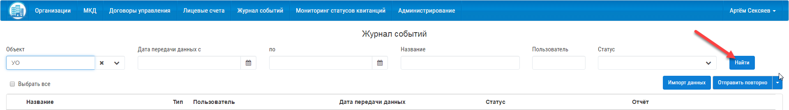
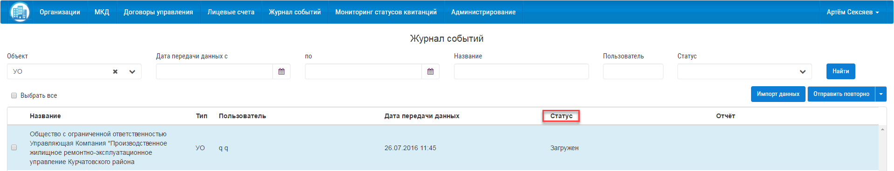

Проверить успешность размещения данных в ГИС ЖКХ можно по различным объектам:

- по многоквартирному дому (МКД);
- по договору управления (ДУ);
- по лицевым счетам (ЛС);
- по организации (УО).

Для просмотра успешного размещения данных на ГИС ЖКХ необходимо:

1. Нажать на вкладку «Журнал событий».

2. Выбрать в поле фильтра  «Объект» (МКД, ДУ, ЛС или УО).

3. Нажать кнопку «Найти».

4. После фильтрации посмотреть статус успешной отправки в столбце «Статус».

