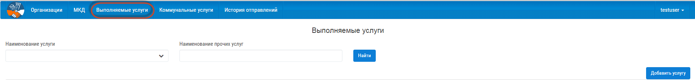
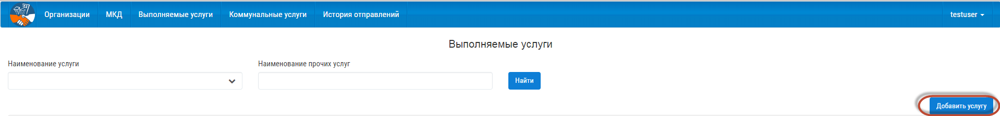
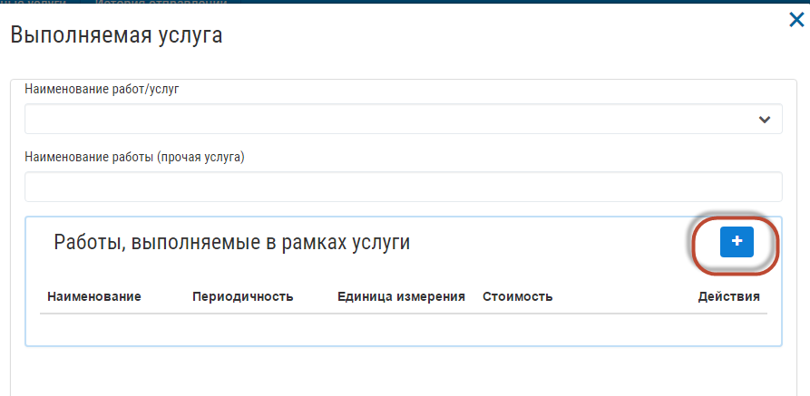
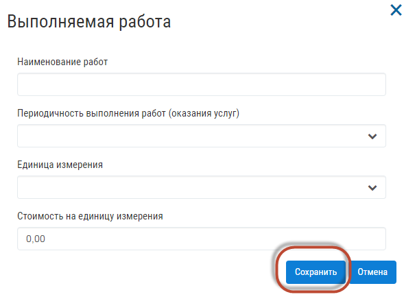
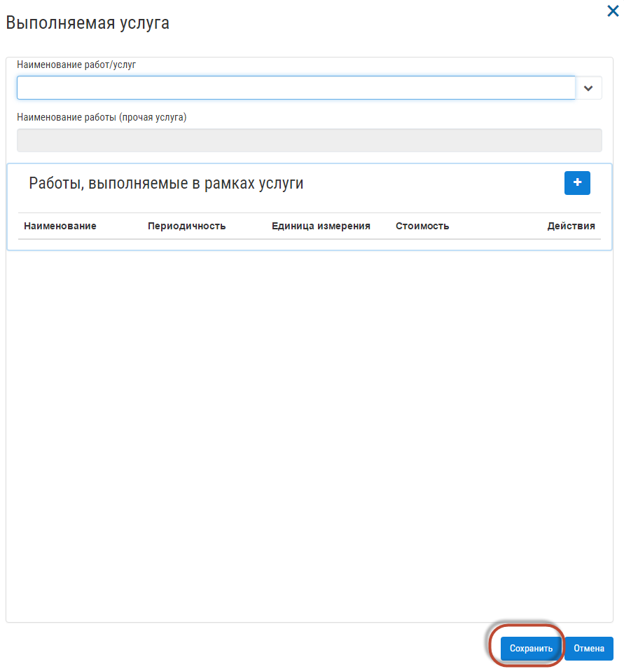

Добавление услуги
------------------

Для добавления выполняемой услуги, перейдите в раздел «Выполняемые услуги».

Для добавления «Выполняемой услуги», нажмите кнопку добавления.

В открывшейся форме заполните информацию по «Выполняемой услуге», для добавления работ, выполняемых в рамках услуги, нажмите на кнопку добавления.

Заполните работы, выполняемые в рамках услуги, и нажмите кнопку «Сохранить».

После сохранения, введенные значения отобразятся в форме. Для редактирования или удаления добавленных работ нажмите на кнопку удаления или редактирования, напротив работы.

.. image:: ../_images/05-services-performed/44.png

После заполнения всех полей, нажмите кнопку «Сохранить».
Поле «Наименование работы (прочая услуга)», доступно для редактирования, если в поле «Наименование работ/услуг», указано значение - Прочая работа, услуга.

