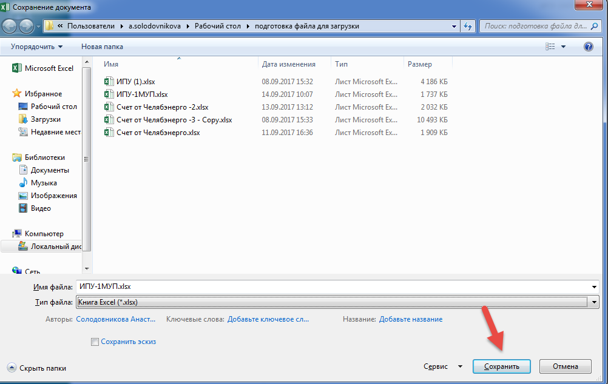
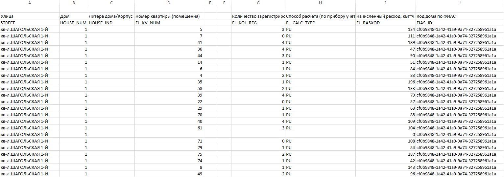

Подготовка файла ИПУ от РСО формата .xlsx к загрузке
------------------------------------------

Для того, чтобы загрузить файл по объемам потребления требуется установить следующий порядок столбцов, соответствующих структуре загружаемого документа и содержащего данные по объемам потребления ИПУ:

#.	Улица;
#.	Номер дома;
#.	Литера;
#.	Номер помещения;
#.	Количество собственников (РСО);
#.	Общая площадь помещения (РСО);
#.	Количество жильцов (прописанных) РСО;
#.	Тип (Способ расчета);
#.	Объем потребления (РСО);
#.	Идентификатор дома по ФИАС;
#.	Норматив потребления в жилых помещениях (РСО);
#.  Код объекта (Номер договора управления) - заполняется для нежилых помещений.

**Важно!** Последовательность столбцов должна быть в строго указном порядке.

Наименования столбцов в шапке загружаемого документа могут отличаться от оригинального названия столбцов.

Для того, чтобы в системе была создана карточка с объемом потребления ИПУ, в загружаемом файле обязательно должны быть заполнены столбцы: «Адрес», «Номер дома», «Номер помещения». 

Если обязательные поля не будет заполнены, то карточки с объемом потребления ИПУ не будут созданы в журнале «Объемы потребления ИПУ». 

Если в столбцах: «Количество собственников (РСО)», «Общая площадь помещения (РСО)», «Количество жильцов (прописанных) РСО», «Тип», «Объем потребления (РСО)», «Идентификатор дома по ФИАС», «Норматив потребления в жилых помещениях (РСО)», значения отсутствуют, в карточке объемов потребления ИПУ поля, содержащие данную информацию будут пустыми. 

Для подготовки файла к загрузке требуется:

-	Открыть файл, который планируется для загрузки в систему.

-	Удалить в столбце «Улица» значения: «г.Челябинск» и «д.» с помощью функции замены в шаблоне excel.

-	Удалить столбцы, которые не соответствуют структуре документа для загрузки.

-	Если при подготовке файла отсутствует столбец для структуры документа, необходимо вручную создать данный столбец в загружаемом файле.

-	После того, как порядок столбцов будет скорректирован в соответствии со структурой, шаблон можно считать готовым к загрузке.

По завершению работы с файлом сохраните изменения в шаблоне excel.

-	Файл excel должен содержать расширение .xlsx. Если файл имеет расширение .xls или другой формат excel требуется выполнить преобразование файла в требуемый формат.

-	Нажать на вкладку «Файл».

-	Нажать на вкладку «Сохранить как».

-	Затем указать папку для сохранения шаблона.

-	Выбрать расширение из списка.

-	Нажать кнопку «Сохранить».

Внешний вид файла от МУП ПОВВ подготовленного к загрузке по жилым и коммунальным помещениям
~~~~~~~~~~~~~~~~~~~~~~~~~~~~~~~~~~~~~~~~~~~~~~~~~~~~~~~~~~~~~~~~~~~~~~~~~~~~~~~~~~~~~~~~~~~

Для подготовки файла от МУП ПОВВ требуется:

#.	Удалить столбцы, содержащие данные, которые не требуются к загрузке, такие как: распределенный объем корректировки, начисленный объем корректировки, сумма корректировки, начисленный объем корректировки и другие.
#.	Добавить столбец «Литера», после столбца, содержащего номер дома.
#.	Объединить файлы с объемами потребления и видом расчета по нормативу и по ИПУ от МУП ПОВВ в 1 файл, для последующей загрузки в Систему.
#.	Убрать точки в столбце с номером помещения.

Внешний вид файла после корректировок:

Если в загружаемом файле есть данные по Идентификатору дома по ФИАС и Нормативу потребления, они должны быть расположены после столбца «Объем водоснабжения по квартире» в следующем порядке:

-	Идентификатор дома по ФИАС.

-	Норматив потребления.

Внешний вид файла от МУП ПОВВ подготовленного к загрузке по нежилым помещениям
~~~~~~~~~~~~~~~~~~~~~~~~~~~~~~~~~~~~~~~~~~~~~~~~~~~~~~~~~~~~~~~~~~~~~~~~~~~~~~~~~~~~~~~~~~~

Внешний вид файла от ЧелябЭнерго подготовленного к загрузке по жилым и коммунальным помещениям
~~~~~~~~~~~~~~~~~~~~~~~~~~~~~~~~~~~~~~~~~~~~~~~~~~~~~~~~~~~~~~~~~~~~~~~~~~~~~~~~~~~~~~~~~~~~~~

Для подготовки файла от ЧелябЭнерго требуется:

-	Удалить столбцы и строки, содержащие данные, которые не требуются к загрузке, такие как: код, единица измерения, налоговая ставка, сумма акциза, и другие.

-	Удалить блоки с дополнительной информацией.

-	Убрать точки в столбце с номером помещения. 

Внешний вид файла после корректировок:

Внешний вид файла от ЧелябЭнерго подготовленного к загрузке по нежилым помещениям
~~~~~~~~~~~~~~~~~~~~~~~~~~~~~~~~~~~~~~~~~~~~~~~~~~~~~~~~~~~~~~~~~~~~~~~~~~~~~~~~~

