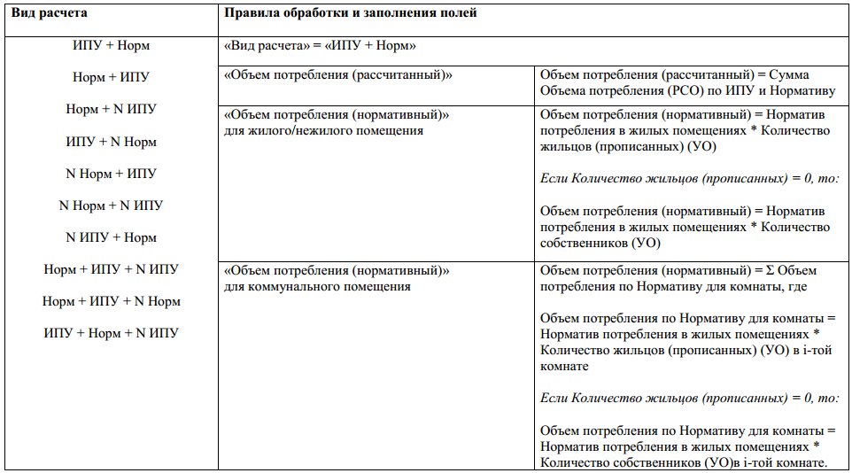
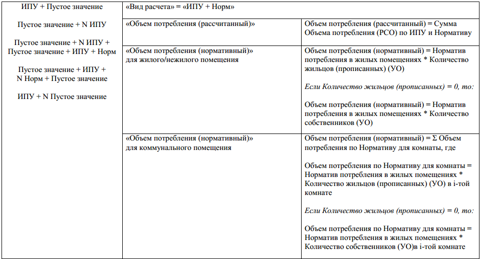
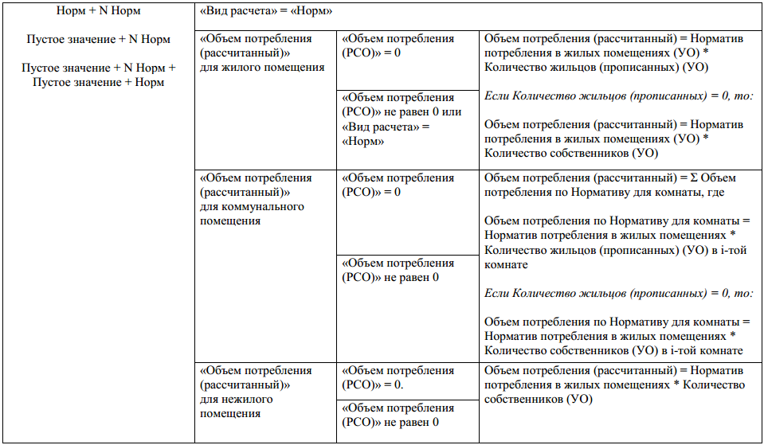
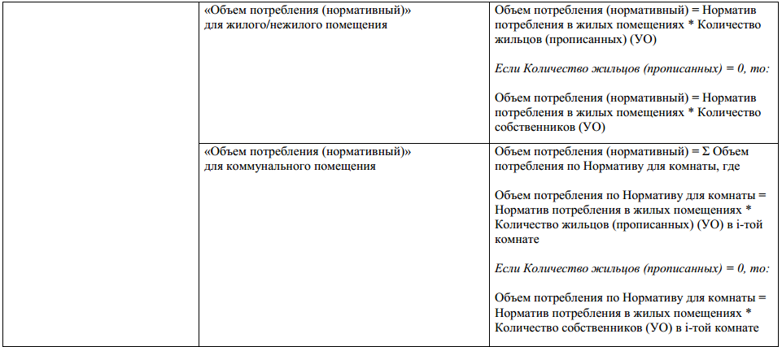
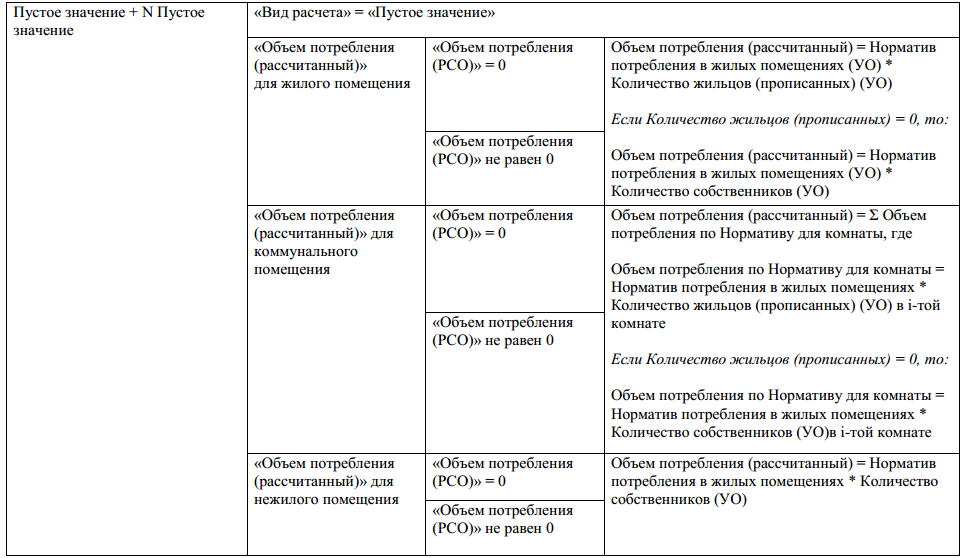
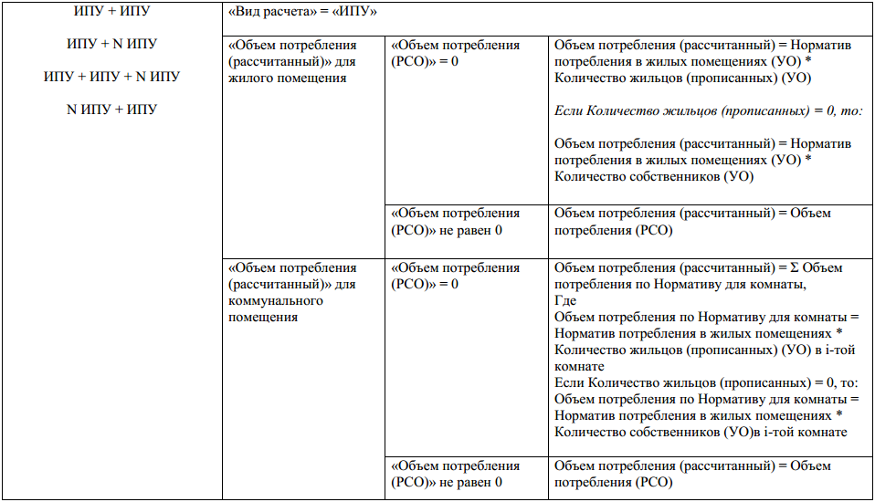
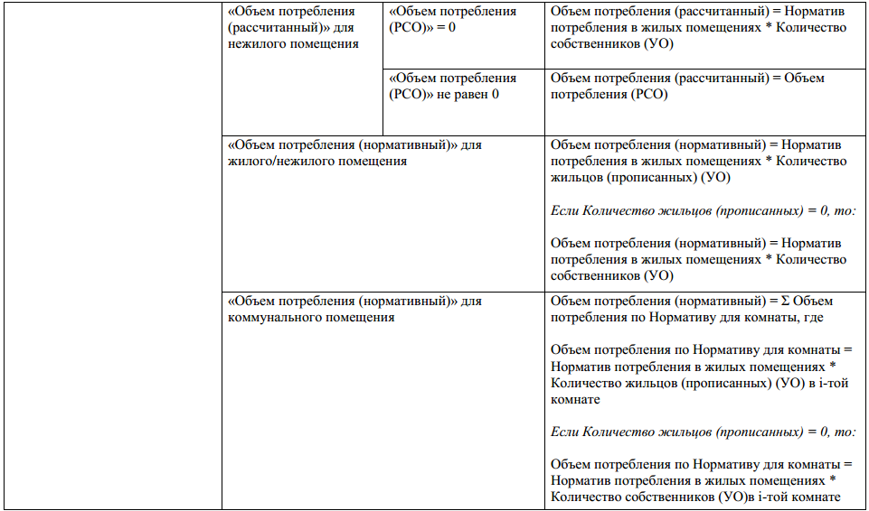

Комбинированные виды расчета объемов потребления ИПУ
------------------------------------------

.. image:: ../_images/06-indicators-pu/74.png

где N - количество загруженных строк с данными по объемам потребления, в одном файле, для одного помещения.

