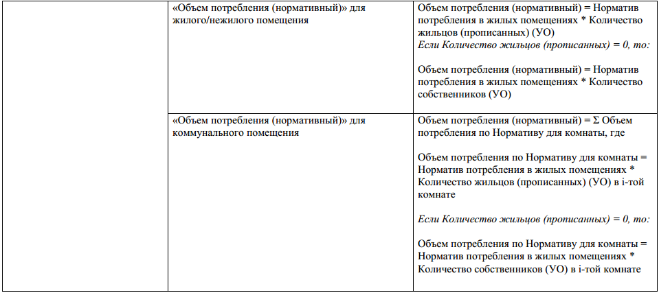

Комбинированные виды расчета объемов потребления ИПУ
------------------------------------------

где N - количество загруженных строк с данными по объемам потребления, в одном файле, для одного помещения.

