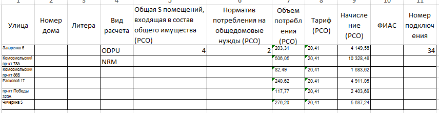
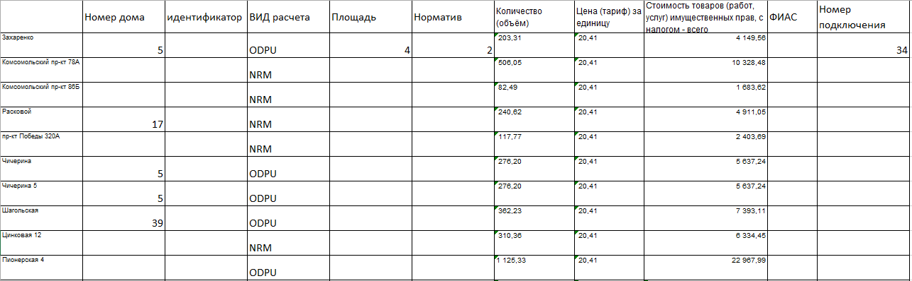
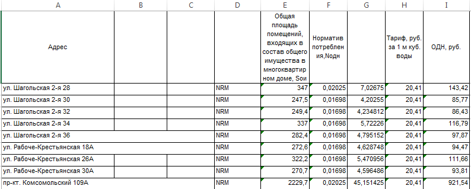
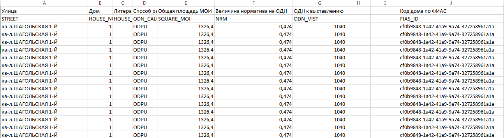

Подготовка файла ОПУ от РСО формата .xlsx к загрузке
----------------------------------------------------

Для того, чтобы загрузить файл по объемам потребления требуется установить следующий порядок столбцов, содержащих данные по объемам потребления и начислениям ОПУ:

-	Улица;
-	Номер дома;
-	Литера;
-	Вид расчета;
-	Общая S помещений, входящая в состав общего имущества (РСО);
-	Норматив потребления на общедомовые нужды (РСО);
-	Объем потребления (РСО);
-	Тариф (РСО);
-	Начисление (РСО);
-	ФИАС;
-	Номер подключения.

**Важно!** Последовательность столбцов должна быть в строго указном порядке.

Наименования столбцов в шапке загружаемого документа могут отличаться от оригинального названия столбцов.

Если в столбце «Улица» будет указан полностью адрес (Улица, Номер дома, Литера) адрес будет корректно распознан и в Системе будет создан объем потребления ОПУ. 

**Важно!** Файл excel должен содержать расширение .xlsx. Если файл имеет расширение .xls или другой формат excel требуется выполнить преобразование файла в требуемый формат.

Внешний вид файла от МУП ПОВВ подготовленного к загрузке 
~~~~~~~~~~~~~~~~~~~~~~~~~~~~~~~~~~~~~~~~~~~~~~~~~~~~~~~~

После выполнения всех корректировок, внешний вид файла, должен выглядеть следующим образом.

Внешний вид файла от ЧелябЭнерго подготовленного к загрузке
~~~~~~~~~~~~~~~~~~~~~~~~~~~~~~~~~~~~~~~~~~~~~~~~~~~~~~~~~~~

После выполнения всех корректировок, внешний вид файла, должен выглядеть следующим образом.

