Загрузка данных в Систему
-------------------------

Перед загрузкой данных в Систему требуется:

-	Проверить актуальность таких данных, как:
-	Наличие всех созданных МКД в Системе, которые находятся в управлении УО. Если созданы не все МКД в Системе, требуется создать данные МКД.
-	Актуальность данных по Нормативам, по всем коммунальным услугам, предоставляемым для каждого многоквартирного дома. Если информация неактуальна, требуется выполнить обновление данных в Системе при помощи загрузки архива. Информация по нормативам выгружается из 1С с данными по «Объемам потребления ОПУ» и обновляется при загрузке данного архива в журнале «Объемы потребления и начисления ОПУ».
-	Актуальность данных по площадям в МКД. Если информация не актуальна, требуется выполнить загрузку архива, содержащего данные по площадям. Загрузку архива требуется выполнять в Системе, в журнале «Многоквартирные дома».
-	Выполнить проверку ранее напечатанных квитанций, содержащих актуальную информацию по количеству собственников и жильцов. Если количество собственников и жильцов были изменены, перед загрузкой данных требуется выполнить повторную печать квитанций с актуальными данными по количеству собственников и жильцов.
-	Для нежилых помещений проверить наличие заполненного номера договора (код объекта), для последующего создания объемов потребеления ИПУ.

**Важно!** При выполнении расчета по объемам потребления и начислениям для расчета будут использованы последние загруженные данные по жильцам и собственникам, которые были переданы при печати квитанции.

Загрузка файла ИПУ от РСО по жилым, нежилым и коммунальным помещениям
~~~~~~~~~~~~~~~~~~~~~~~~~~~~~~~~~~~~~~~~~~~~~~~~~~~~~~~~~~~~

Для загрузки данных в Систему по объемам потребления ИПУ необходимо:

-	Открыть журнал «Объемы потребления ИПУ», выбрав в верхнем меню «Показатели ПУ», затем «ИПУ».

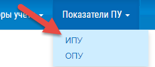
 
-	Нажать на кнопку «Загрузить» для загрузки файла с объемами потребления ИПУ.

-	Заполнить поля открывшейся формы указав: период, за который требуется загрузить данные, коммунальный ресурс, а также прикрепить файл с объемами потребления ИПУ.

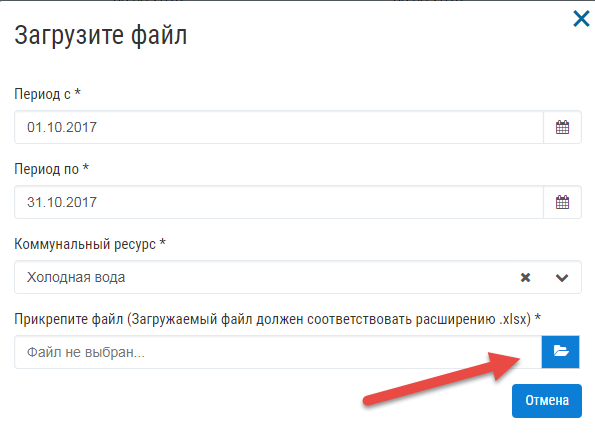

-	После прикрепления файла на форме будет отображена кнопка «Загрузить», при нажатии на которую будет выполнена загрузка файла в Систему.

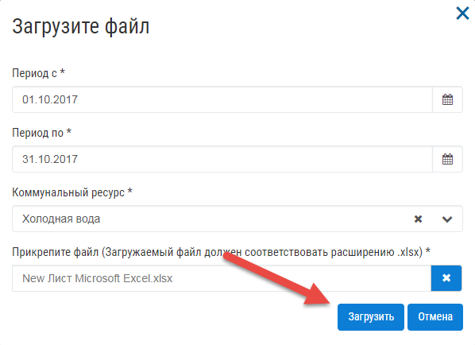

-	После начала загрузки файла в Систему будет отображено информационное сообщение.

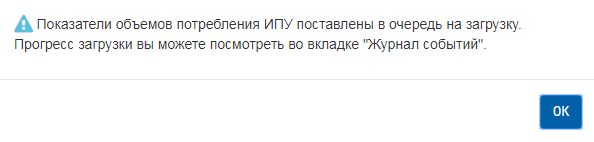

- Для просмотра информации по статусу обработки файла требуется перейти в «Журнал событий», выбрав в верхнем меню «Сервис», затем «Журнал событий».

В столбце «Статус» будет отображена информация о количестве успешно обработанных строк с данными по объемам потребления из общего количества загруженных строк с данными.

**Важно!** Если в загружаемом файле не были указаны значения в столбцах: «Адрес», «Номер дома», «Номер помещения», «Код объекта» - для нежилого помещения, данные строки в общем количестве загруженных строк в «Журнале событий» не будут отображены.

**Важно!** Для создания карточки с объемом потребления ИПУ по нежилым помещениям, значение указанное в поле «Код объекта», формы редактирования нежилого помещения, должен соответствовать значению в загружаемом файле в столбце «Код объекта/Номер договора». Если значения не совпадают, карточка с объемом потребления не будет создана в системе. 

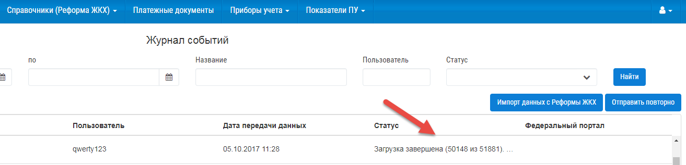

При наведении курсором на текст статуса, будет отображен полный текст сообщения, содержащегося в статусе <Не все данные, были загружены в систему. Возможно в системе не найден многоквартирный дом, помещение, не указано одно из обязательных полей: Адрес МКД, № помещения>. 

При получении данного сообщения необходимо проверить загружаемый файл на наличие значений в столбцах «Адрес», «№ помещения» для передаваемых объемов потребления и при нахождении пустых значений в данных столбцах заполнить их. Затем повторно загрузить файл.

Если все поля для столбцов «Адрес» и «№ помещения» заполнены, требуется обратится к администратору для устранения ошибок при загрузке файла.

После загрузки данных в журнал «Объемы потребления ИПУ» будут созданы записи с загруженными данными.

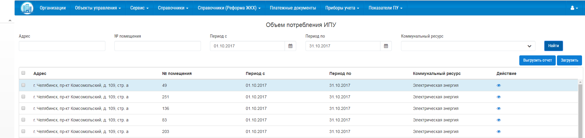

Для просмотра созданного объема потребления требуется нажать на кнопку просмотра.

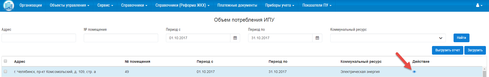

После чего будет открыта карточка с объемом потребления ИПУ.

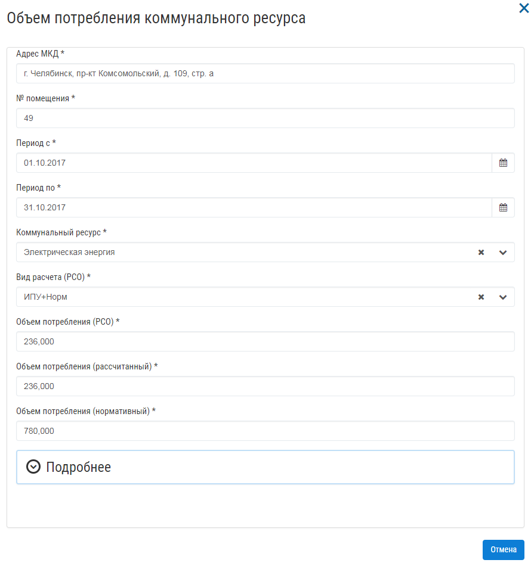

Заполнение полей в карточке происходит следующим образом.

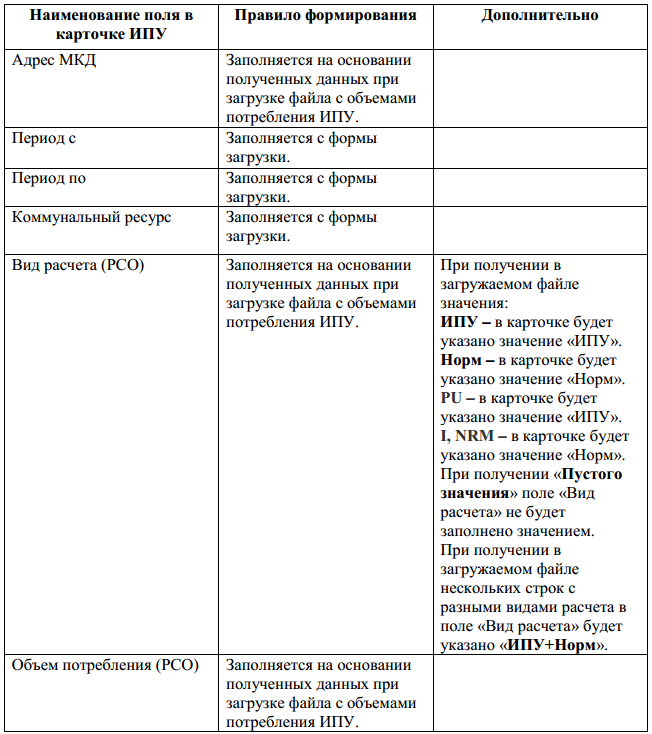

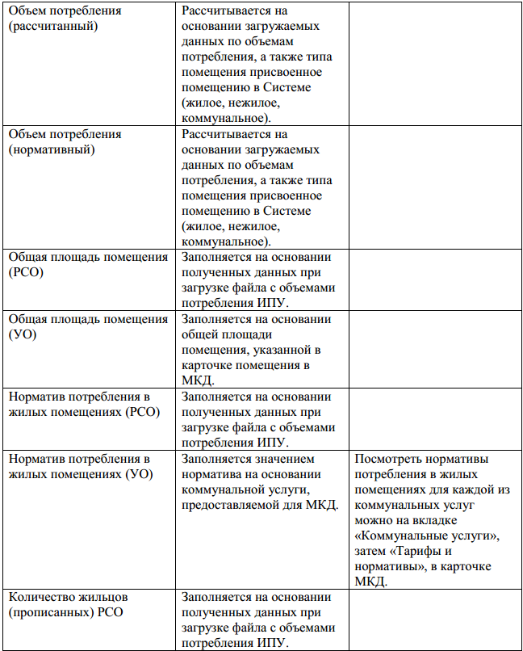

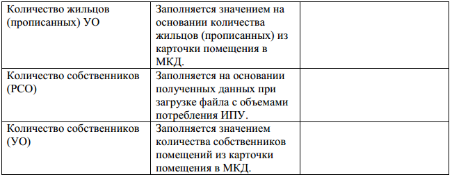

**Важно!** Если значения для полей «Количество жильцов (прописанных) УО» и «Количество собственников (УО)» были обновлены в МКД до загрузки показателей с объемами потребления ИПУ, расчет будет произведен с учетом количества жильцов/собственников, которые были указаны в момент загрузки.

Если значения для полей «Количество жильцов (прописанных) УО» и «Количество собственников (УО)» были обновлены после загрузки показателей объемов потребления ИПУ, перерасчет значений в карточках ИПУ выполнен не будет. Для этого требуется выполнить повторную загрузку показателей ИПУ.

**Важно!** При получении «Пустого значения» в поле «Вид расчета» значение в поле «Объем потребления (рассчитанный)» будет рассчитано по нормативу.

Для того, чтобы обновить данные по ранее загруженным объемам потребления ИПУ требуется выполнить повторную загрузку файла за тот же период.

**Важно!** При обновлении значений по объемам потребления указанные значения в полях «Период с» и «Период по» на форме загрузки, должны строго совпадать со значениями, загруженными ранее. Например, если ранее в систему были загружены данные по объемам потребления ИПУ за период 1.09.17 – 30.09.17, при обновлении данных период загрузки должен быть 1.09.17 – 30.09.17. 
Если пользователем при попытке обновить данные по объемам потребления ИПУ был указан период 1.09.17 – 31.09.17 данные обновлены не будут. В системе будут созданные новые карточки с объемами потребления за период с 1.09.17 – 31.09.17.

**Важно!** Если в загружаемом от РСО файле отсутствуют данные по объемам потребления ИПУ для помещений, которые созданы в МКД в Системе, для них будут автоматически созданы карточки с рассчитанным объемом потребления по нормативу и видом расчета «Норм».

Загрузка файла ОПУ от РСО
~~~~~~~~~~~~~~~~~~~~~~~~~

**Важно!** Перед тем как загрузить файл с объемами потребления и начислениями ОПУ за требуемый период, в Систему уже должен быть загружен файл с данными по объемам потребления ИПУ за тот же период на основании которого планируется загрузка файла с данными по объемам потребления и начислениям ОПУ.

Для загрузки данных в Систему по объемам потребления и начислениям ОПУ необходимо:

-	Открыть журнал «Объемы потребления и начисления ОПУ», выбрав в верхнем меню «Показатели ПУ», затем «ОПУ».

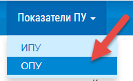

-	Нажать на кнопку «Загрузить» для загрузки файла с объемами потребления и начислениями ОПУ.

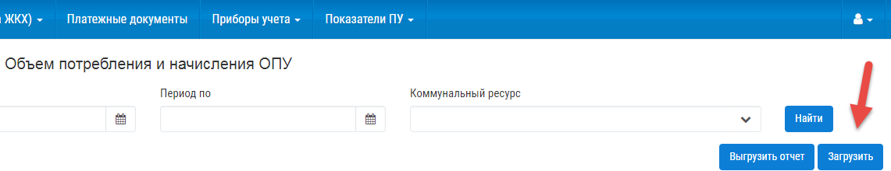

- 	В открывшейся форме выбрать тип данных для загрузки.

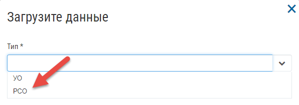

-	Заполнить поля формы указав: период, за который требуется загрузить данные, коммунальный ресурс, а также прикрепить файл с объемами потребления и начислениями ОПУ. Затем нажать на кнопку «Загрузить» .

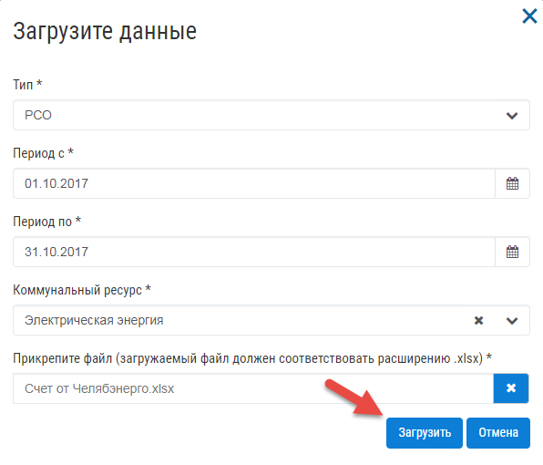

-	После начала загрузки файла в Систему будет отображено информационное сообщение.

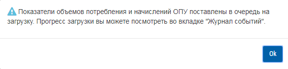

Для просмотра информации по статусу обработки файла требуется перейти в «Журнал событий», выбрав в верхнем меню «Сервис», затем «Журнал событий».

В столбце «Статус» будет отображена информация о количестве успешно обработанных строк по объемам потребления и начислениям из общего количества загруженных строк с данными по объемам потребления и начислениям.

При наведении курсором на текст статуса, будет отображен полный текст сообщения: <Внимание! Не все данные были загружены в систему. Возможно, в системе не найден МКД.> 

Для этого требуется проверить передаваемый адрес в столбцах «Адрес» и «Номер дома» в загружаемом шаблоне, а также наличие созданных МКД в Системе. При нахождение пустых значений в столбцах заполнить их. 
При отсутствии МКД, создать в Системе многоквартирный дом.

**Важно!** Столбец «Номер дома» может быть не заполнен, если в столбце «Адрес» указан номер дома.

Если по указанной причине не найдено ошибок, созданы все МКД для передаваемых данных, требуется обратиться к администратору для устранения ошибок при загрузке файла. 
После загрузки данных в журнале «Объемы потребления и начисления ОПУ» будут созданы записи с загруженными данными. 

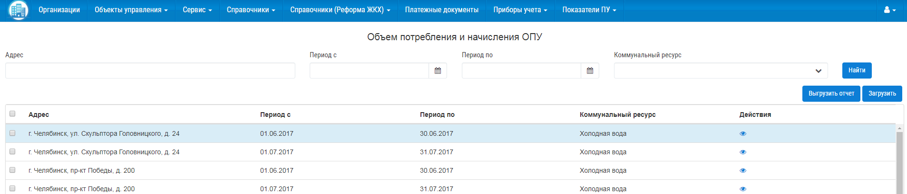

Для открытия карточки с данными по объемам потребления и начислениям ОПУ необходимо нажать на кнопку просмотра.

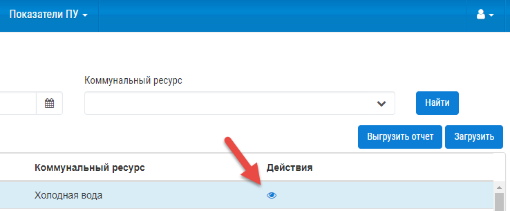

После чего будет открыта карточка с объем потребления и начислением ОПУ.

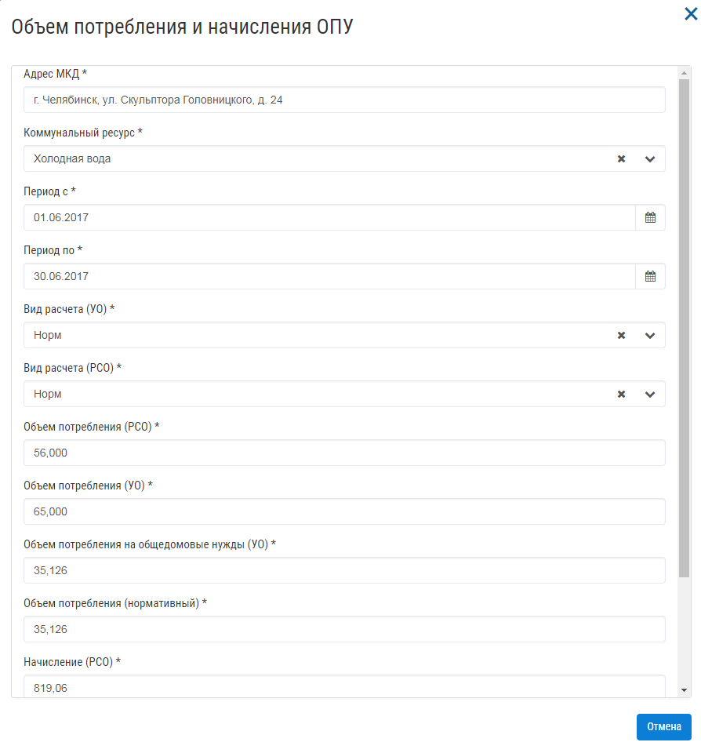

Заполнение полей в карточке ОПУ происходит следующим образом.

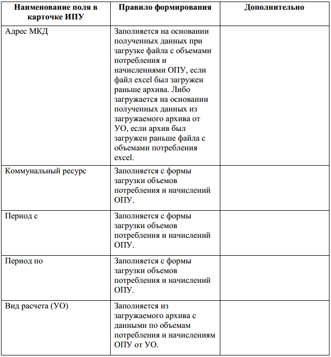

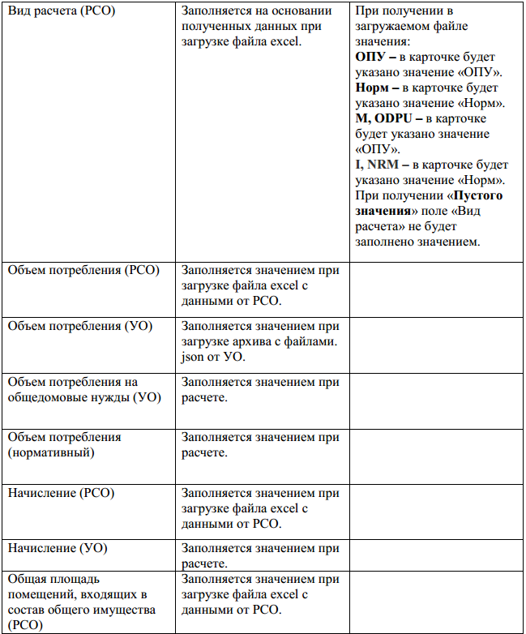

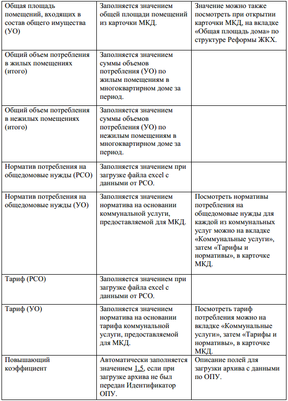

Для того, чтобы обновить данные по ранее загруженным объемам потребления и начислениям ОПУ требуется выполнить повторную загрузку файла.

**Важно!** При обновлении значений в объемах потребления и начислениях, указанные значения в полях «Период с» и «Период по» на форме загрузки, должны совпадать со значениями, загруженными ранее. 
Например, если ранее в систему были загружены данные по объемам потребления ОПУ за период 1.09.17 – 30.09.17, при обновлении данных период загрузки должен быть 1.09.17 – 30.09.17. Если пользователем при попытке обновить данные по объемам потребления ОПУ был указан период 1.09.17 – 31.09.17 данные обновлены не будут. 
В системе будут созданные новые карточки с объемами потребления за период с 1.09.17 – 31.09.17.

Загрузка архива ОПУ от УО
~~~~~~~~~~~~~~~~~~~~~~~~~

Загружаемый архив с данными по объемам потребления и начислениям ОПУ от УК, должен иметь расширение .zip. 
Если загружаемый архив будет иметь иное расширение, например, .rar, пользователю будет отображено предупреждающее сообщение.

Для загрузки архива с данными по объемам потребления от управляющей компании, требуется:

-	Открыть журнал «Объемы потребления и начисления ОПУ».

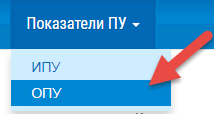

-	Нажать на кнопку «Загрузить».

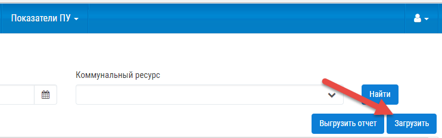

-	Указать тип загружаемых данных.

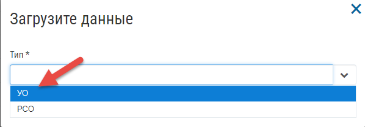

-	Прикрепите файл для загрузки и нажмите кнопку «Загрузить».

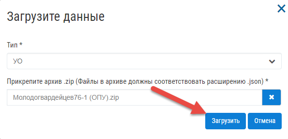

-	После того, как начнется обработка архива Системой, будет отображено информационное сообщение.

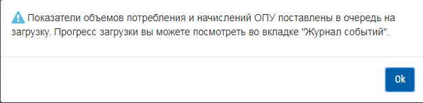

Информация о статусе загрузки будет отображена в «Журнале событий».

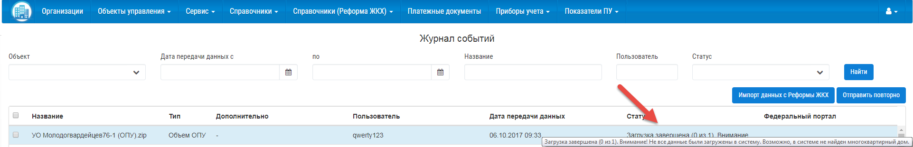

В столбце «Статус» будет отображена информация о количестве успешно загруженных файлов формата .json из общего количества загружаемых файлов в архиве.

Если не все данные были загружены в Систему в столбце статус будет отображено информационное сообщение <Внимание! Не все данные были загружены в систему. Возможно, в системе не найден многоквартирный дом.>

При получении данного сообщения требуется проверить наличие созданных МКД в системе, для которых была выполнена загрузка. Если в Системе созданы все МКД, требуется обратиться к администратору. 

