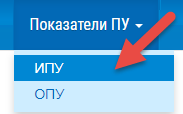
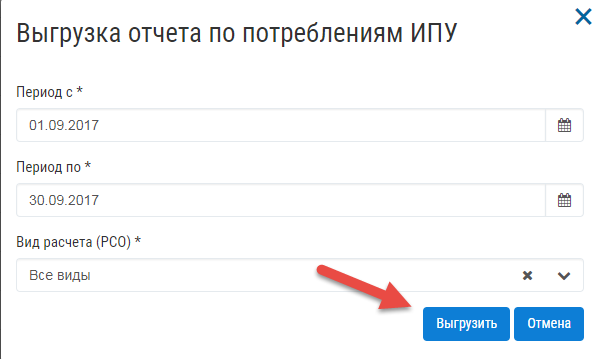
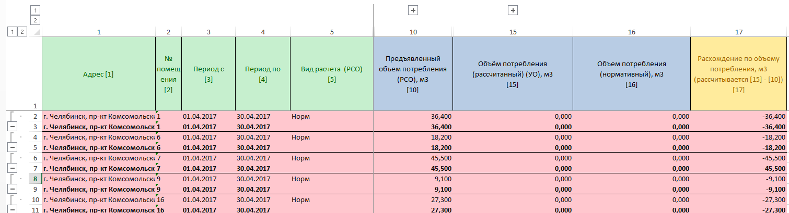
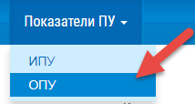
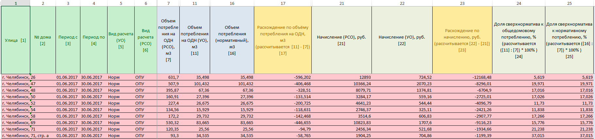
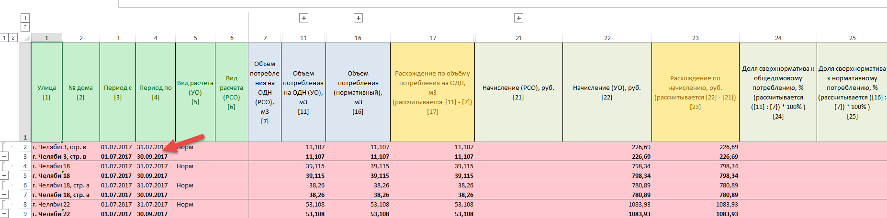

Выгрузка показателей в шаблон excel
-----------------------------------

Выгрузка показателей ИПУ в шаблон excel
~~~~~~~~~~~~~~~~~~~~~~~~~~~~~~~~~~~~~~~

Для выгрузки данных в шаблон excel требуется:

-	Открыть журнал «Объемы потребления ИПУ».

-	Нажать на кнопку «Выгрузить отчет».

- 	Заполнить поля формы указав период, за который требуется выполнить выгрузку данных.

В поля «Вид расчета» можно выбрать следующие значения для формирования отчета:

-	«Все виды» – в шаблон будут выгружены все виды расчета (ИПУ, Норм, ИПУ+Норм, а также «Пустое значение» в поле «Вид расчета»).
-	«ИПУ» – в шаблон будут выгружены только показатели с видом расчета «ИПУ».
-	«Норм» – в шаблон будут выгружены только показатели с видом расчета «Норм».
-	«ИПУ + Норм» – в шаблон будут выгружены только показатели с видом расчета «ИПУ+Норм».
-	 Не указано» – в шаблон будут выгружены только те показатели, у которых в поле «Вид расчета» не указано значение, а именно «Пустое значение». 

- 	После заполнения всех полей формы, нажать на кнопку «Выгрузить».

-	Сформированный отчет можно загрузить на ПК в «Журнале событий», нажав на ссылку для скачивания в столбце «Дополнительно».

В выгруженном отчете будут отображены расхождения в объемах потребления ИПУ между «Объемом потребления (РСО)» и «Объемом потребления (УО)». 
Если были выявлены расхождения между предъявленными объемами, строка с данными по объемам потребления ИПУ в выгруженном файле будет выделена красным цветом.

Те показатели по объемам, для которых не было выявлено расхождение не будут выделены цветом. В шаблоне также можно посмотреть информацию по количеству собственников, общей площади помещения, количеству жильцов и другую.

Строка, выделенная в шаблоне жирным, является строкой с нарастающим итогом. В ней отражается общая информация по объемам потребления за весь выгружаемый период. Например, если данные были выгружены за 3 месяца, в данной строке будут отображены суммарные показатели: «Предъявленный объем потребления (РСО)», «Объем потребления (рассчитанный) (УО)», «Объем потребления (нормативный)» за 3 месяца.

Строка с нарастающим итогом будет отображена только в том случае, если в поле «Вид расчета», на форме выгрузки шаблона, будет указано значение «Все виды».

При выгрузке данных в шаблон, для помещений, объемы потребления по которым были переданы несколько раз за один период (см. Таблица 7 – Комбинированные виды расчета объемов потребления ИПУ), значения в следующих полях буду просуммированы:

-	Количество жильцов (прописанных) (РСО).
-	Количество собственников (РСО).

Значения, получаемые для заполнения поля «Общая площадь помещения» не будут просуммированы. Значение площади будет отображаться по последнему полученному значению площади для каждого адреса в загружаемом файле.

Выгрузка показателей ОПУ в шаблон excel
~~~~~~~~~~~~~~~~~~~~~~~~~~~~~~~~~~~~~~~

Для выгрузки данных в шаблон excel требуется:

-	Открыть журнал «Объемы потребления и начисления ОПУ».

-	Нажать на кнопку «Выгрузить отчет».

-	Заполнить поля формы указав период, за который требуется выполнить выгрузку данных.

В поля «Вид расчета» можно выбрать следующие значения для формирования отчета:

-	«Все виды» – в шаблон будут выгружены все виды расчета (ОПУ, Норм, а также «Пустое значение» в поле «Вид расчета»).
-	«ИПУ» – в шаблон будут выгружены только показатели с видом расчета «ИПУ».
-	«Норм» – в шаблон будут выгружены только показатели с видом расчета «Норм».
-	«Не указано» – в шаблон будут выгружены только те показатели, у которых в поле «Вид расчета» не указано значение, а именно «Пустое значение».

-	Сформированный отчет можно выгрузить в «Журнале событий», нажав на ссылку для скачивания в столбце «Дополнительно».

В выгруженном отчете будут отображены расхождения в объемах потребления ОПУ между «Объемом потребления на ОДН (РСО)» и «Объемом потребления на ОДН (УО)», а также расхождения значений в полях «Начисление (РСО)» и «Начисление (УО)». 

Если были выявлены расхождения между предъявленными объемами и/или начислениями, строка с данными в выгруженном файле будет выделена красным цветом.

Те показатели по объемам и начислениям, для которых не было выявлено расхождение не будут выделены цветом. В шаблоне также можно посмотреть информацию по общей площади помещений, входящих в состав общего имущества, нормативу потребления на ОДН, Доли сверхнорматива и других.
Строка, выделенная в шаблоне жирным, является строкой с нарастающим итогом.

В ней отражается общая информация по объемам потребления за весть выгружаемый период. Например, если данные были выгружены за 3 месяца, в данной строке будут отображены суммарные показатели: «Объем потребления на ОДН (УО)», «Объем потребления (нормативный)», «Расхождение по объему потребления на ОДН», «Начисление (РСО)», «Начисление (УО)», «Расхождение по начислению» за 3 месяца.

Строка с нарастающим итогом будет отображена только в том случае, если в поле «Вид расчета», на форме выгрузки шаблона, будет указано значение «Все виды».

