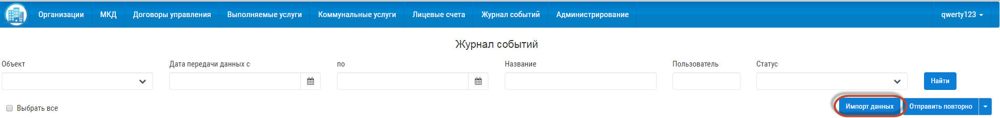
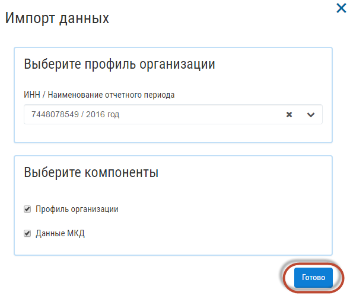
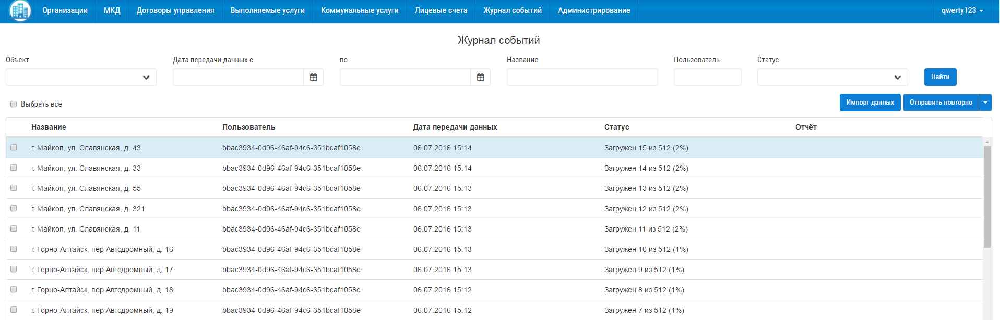

Для импорта данных с Реформы ЖКХ нажмите на кнопку «Импорт данных».

Введите ИНН/Наименование отчетного периода, данные по которому требуется загрузить, а также Профиль организации и/или МКД и нажмите кнопку «Готово».

Загруженные данные отобразятся в разделе «Журнал событий».

Если сведения по организации или МКД за данный текущий период уже были загружены, то данные обновятся.
